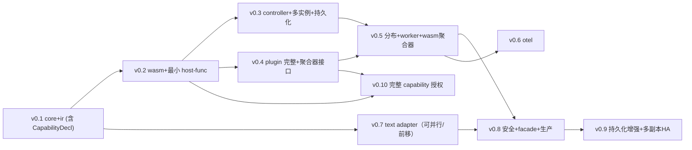

# Shiroha 执行计划（implement.md）

> 父任务 `.trellis/tasks/06-25-shiroha-arch` 的执行计划。**父任务不直接实现**（仅最终集成评审 + spec 沉淀）。术语以 `glossary.md` 为权威。采用**版本里程碑**分步实现：每个版本 = 一个 child task，**到点才创建并细规划**（不一次性建全部 child），让下一版本可基于上一版本测试结果微调。MVP 聚焦 WASM 路径，文本 adapter 延后到 v0.7。产品决策见 `prd.md`，技术设计见 `design.md`，选型证据见 `research/`。

## 版本路线图（AC8）

每个版本独立可测试，到点给你微调方案/测试机会。`依赖` 为前置版本。

| 版本 | 交付物 | 依赖 | 可测试验证 | 产出 crate |
| --- | --- | --- | --- | --- |
| **v0.1** 引擎内核 | `SmIr` 定义（含 `CapabilityDecl` + `ActionRef::Plugin{plugin_id, method}` 一次定对）；层级+并行 statechart 引擎；RTC 转换步；转换路径缓存；async 动作 future + 完成事件队列；**纯逻辑无 runtime**，用 mock 动作测试 | — | 单测：嵌套/并行/历史/guard fixture，事件驱动推进，mock 动作完成事件回流正确 | `shiroha-ir`, `shiroha-core` |
| **v0.2** WASM 单机运行 | WASM CM adapter（bindgen! `define()`/WASI+`shiroha:*` caps host trait + `From<MachineDef>` + 动作按名动态 `TypedFunc` + fuel/epoch 沙箱）+ **最小 host-func 通道**（直接接线几个固定 host func 让示例能跑，无完整授权）+ 最小 runner binary | v0.1 | 集成测：加载示例 wasm 组件 → `define()` 得 `SmIr` → 事件驱动 → 动作本地执行 → 沙箱超时拦截 | `shiroha-adapter`, `shiroha-adapter-wasm`, `shiroha-plugin-sdk`(最小), dev runner bin |
| **v0.3** 控制器+多实例+持久化 | `Controller` API（task CRUD/pause/resume/query/submit_event + 创建时声明 `PersistencePolicy`）+ 多实例托管（每实例 `Store<T>` + 独立事件队列 + `LocalSet`/`Arc<Mutex>` 处理 `!Sync`）+ 基础 `tracing` 日志（无 OTel exporter）+ **持久化与崩溃恢复**：`EventStore` trait + 默认本地文件实现 + Realtime/Deferred/None 三模式 + event-sourcing 落盘 + snapshot 加速重放 + 引擎持久化 hook + 崩溃恢复重放 | v0.1, v0.2 | 集成测：多 task 并发 + 生命周期 + 暂停/恢复 + 事件提交；**Realtime task 跑中杀进程→重启→从 log 重放恢复零丢失；Deferred task→从 snapshot+部分 log 恢复；None task→丢** | `shiroha-controller`, `shiroha-persist`(新) |
| **v0.4** plugin 完整化 | plugin 扩展机制：wasm plugin 加载 + host-native plugin 注册表 + semver major 协商 + 资源限额沙箱；`adapter-wasm` 按 `ActionRef::Plugin{plugin_id, method}` 解析调用；**聚合器接口定义**（有状态 CM resource 句柄 create/on-result/destroy）。**capability 授权从本版剥离至 v0.10**（v0.4 仍用 v0.2 的最小 host-func 通道） | v0.2 | 集成测：wasm plugin 示例 + host-native plugin 示例 + 版本协商 + 资源超限拦截 + 聚合器句柄生命周期 | `shiroha-plugin-sdk`(完整), `shiroha-adapter-wasm` 接入 |
| **v0.5** 分布调度+worker | `Transport` trait + `tonic` gRPC bidi `Dispatch` proto + trace 注入/提取占位 + `shiroha-scheduler`（distributed action 分发 + fan-out + **目标控制 Any/Pool/Label/Explicit** + **内置 4 聚合策略 Rust 原生 + 自定义 wasm 聚合器调用** + 关联器，预留 `dispatch_id`）+ `shiroha-worker`（无状态动作执行器：WasmFunc=机器组件导出 / Plugin=内置或用户插件）+ worker binary | v0.2, v0.4 | 集成测：多 worker + fan-out N 分片 + 各内置策略 + 自定义 wasm 聚合器 + 目标约束 + 失败→`error.*` 回流 + `required_capabilities` 拒绝 | `shiroha-transport`, `shiroha-transport-grpc`, `shiroha-scheduler`, `shiroha-worker`, worker bin |
| **v0.6** OpenTelemetry | `shiroha-otel`（tracing subscriber + OTLP/gRPC exporter + MetricsLayer(feature) + logs appender，0.32 lockstep）+ 全层 `tracing` 埋点接入 + per-task span + 跨 worker trace context 传播（transport-grpc 注入/提取 W3C `traceparent`） | v0.3, v0.5 | 集成测：mock collector 收到 per-task trace + 分布式动作 trace 跨 orchestrator+worker 拼接 | `shiroha-otel`, `shiroha-transport-grpc` 传播 |
| **v0.7** 文本 adapter 回归 | JSON/YAML/TOML → `SmIr`（serde_json / serde-saphyr / toml）+ TOML 友好的 IR 形状校验 | v0.1 | 测试：三格式解析 fixtures → 与手构 `SmIr` 相等性 + 三格式互转一致 + 与 wasm 定义并存 | `shiroha-adapter-text` |
| **v0.8** 安全+facade+生产化 | 控制器 auth（token/api-key）完整化 + TLS（orchestrator↔worker、controller↔Web）+ `shiroha` facade（电池齐全默认栈 + feature flags）+ `bin/shiroha-orchestrator` 编排进程 + controller Web service boundary（gRPC vs HTTP/REST 选型） | v0.3–v0.7 | E2E：编排进程 + ≥1 worker，跑一台机跨 orchestrator+worker，task 生命周期 + OTel trace + auth + TLS | `shiroha`(facade), orchestrator bin, controller auth/TLS |
| **v0.9** 持久化增强 + 多副本 HA（进阶） | 基于 v0.3 持久化基础增强：分布式 `EventStore` 后端 + 多副本 HA（leader-follower）+ in-flight 分布式动作完整恢复（`dispatch_id` 关联，v0.5 预留字段在此完整化） | v0.5, v0.8 | 集成测：多副本 leader 切换 → 实例状态在 follower 恢复 → 分布式动作重新关联 → 继续 | `shiroha-persist`(增强), `shiroha-controller` |
| **v0.10** 完整 capability 授权（未来版本，非 MVP） | 完整 WASI caps + 框架原生 `shiroha:*` caps + task 创建时授权流程（声明→申请→白名单注入→未授权拒绝实例化）+ 能力校验完整化 + wasm plugin caps 合集授权 | v0.2, v0.4 | 集成测：组件声明 caps → task 创建授权 → 未授权 cap 实例化失败 → 授权后正常执行 → wasm plugin caps 合集授权 | `shiroha-adapter-wasm`(授权), `shiroha-controller`(授权 API), `shiroha-plugin-sdk` |

**版本特性**：
- v0.2 的「最小 host-func 通道」直接接线（如 `wasi:filesystem` 几个固定函数、`shiroha:log`），让 wasm 动作能做 I/O 跑真实示例；**完整 capability 授权流程推迟到 v0.10**（v0.4 只做 plugin 系统，不含授权）。
- v0.7 文本 adapter 仅依赖 v0.1（ir），位置灵活，可按需前移。
- OTel 分两段：v0.3 基础 `tracing` 日志（无 exporter），v0.6 完整 OTel export + 跨 worker 传播。
- 每个版本到点才创建对应 child task 并细规划，**不一次性建 9 个 child**，让后版本基于前版本测试结果微调。

## 依赖顺序图


v0.3 持久化与多实例同期落地；v0.5 分布式动作预留 `dispatch_id`；v0.9 在 v0.3 基础上做分布式存储+多副本 HA；v0.10 完整 capability 授权（非 MVP，依赖 v0.2 wasm adapter + v0.4 plugin 系统）。

## 执行检查清单（父任务视角）

1. **逐版本创建+规划**：每个版本到点执行 `task.py create "<title>" --slug v0X-<name> --parent .trellis/tasks/06-25-shiroha-arch`，再走该 child 的 Phase 1（prd/design/implement），在 child prd 写明前置版本 ordering；**child 规划时新增术语追加到 `glossary.md`**。
2. **逐版本实现**：`task.py start` 该 child → 实现 → `trellis-check` → 归档。
3. **版本间微调点**：每版本测试完成后，与用户复盘，可调整下一版本范围/方案（回 Phase 1 改下一版本 child 的 prd）。
4. **集成评审（父任务，v0.8 后）**：跨版本验收 AC1–AC8；技术选型落地核对 `[workspace.dependencies]` pin 与 research 结论一致。
5. **spec 更新（Phase 3.3）**：把架构契约（IR、adapter trait、Transport trait、能力 ABI、crate DAG、OTel lockstep、YAML crate 选择）沉淀到 `.trellis/spec/backend/`（或新建 `rust/` spec）；**`glossary.md` 提升为 `.trellis/spec/backend/glossary.md` 作为仓库级永久术语 spec**。

## 验证命令（通用，各版本具体化）

```bash
cargo build --workspace                                  # 全工作区构建
cargo test -p <crate>                                    # 单 crate 测试
cargo test --workspace                                   # 全测试
cargo clippy --workspace --all-targets -- -D warnings    # lint
cargo fmt --all -- --check                               # 格式
# protoc 构建依赖（v0.5 起）：确保 protoc 在 PATH（或 protoc-bin-vendored）
```

各版本集成测需起 tonic server/client（v0.5/v0.6/v0.8）；OTel 测用 mock collector（v0.6/v0.8）。

## 评审门 / 回滚点

- **G1 父规划评审**（Phase 1.4）：用户复核 prd.md + design.md + implement.md + research/，通过后才创建 v0.1 child 并 `task.py start`。
- **G2 v0.1 引擎契约冻结**：`SmIr` + 引擎接口定后下游版本依赖它；v0.1 完成后设冻结点，变更需回 Phase 1 改 IR 契约并同步后续版本。
- **G3 v0.2 wasm 契约冻结**：WIT world + canonical action ABI 定后，worker/插件依赖它。
- **G3a v0.3 持久化契约冻结**：`EventStore` trait + `PersistencePolicy` + 引擎持久化 hook 定后，v0.5 分布式动作恢复/v0.9 多副本依赖它。
- **G4 版本间微调门**：每版本测试完成 = 一个微调机会，可改下一版本方案。
- **G5 v0.8 集成评审**：父任务最终验收（MVP 完整），失败则回对应版本修复。
- **G6 v0.9 持久化评审**：崩溃恢复可用性验收（可选能力，非 MVP 必需）。

## 风险监控（来自 design.md §10）

- OTel 0.32 lockstep：升级时整 workspace 同步（v0.6 守护）。
- YAML crate：v0.7 pin 前复核 `serde-saphyr` 版本。
- bindgen!/动态调用张力：v0.2 验证固定 action ABI（`list<u8> -> result<list<u8>, string>`）可覆盖所有动作类型；WASI worlds host trait 用 bindgen! 生成，动作按名动态调用。
- `Store` `!Sync`：v0.2/v0.3 验证多实例并发模型不踩 Sync 约束（LocalSet 或 Arc<Mutex<Store>）。
- protoc 构建依赖：v0.5 起 CI/devshell 文档化，或用 protoc-bin-vendored hermetic。
- 编排进程单点：v0.3 起持 Realtime/Deferred/None 三模式可选恢复；v0.9 多副本 HA（进阶）。
- 持久化性能：Realtime per-event fsync 开销大，测吞吐下限；Deferred 验证窗口内崩溃丢进度可接受。
- wasm 聚合器句柄生命周期：v0.4/v0.5 测 CM resource create/on-result/destroy 不泄漏；超时→`error.*`。
- `wasi-http` 仍实验性：v0.10 完整授权时复核 wasmtime WASI preview2 接口成熟度，必要时仅启用稳定 worlds（`io`/`clocks`/`filesystem`/`sockets`）。
- capability/plugin 分离边界：v0.4 实现时严守「plugin 不含 capability、capability 不经 plugin」；`http`/`fs` 走 WASI caps，`shell`/`log` 走 `shiroha:*` caps，不回退为 plugin。

## 父任务自身实现范围

父任务**不做业务代码**，仅可能做：工作区根 `Cargo.toml`（virtual manifest + `[workspace.dependencies]`）骨架（若 v0.1 之前需要）；集成评审与 spec 沉淀。否则父任务保持 `planning`/不做 `task.py start`，由各版本 child task 进入 `in_progress`。
