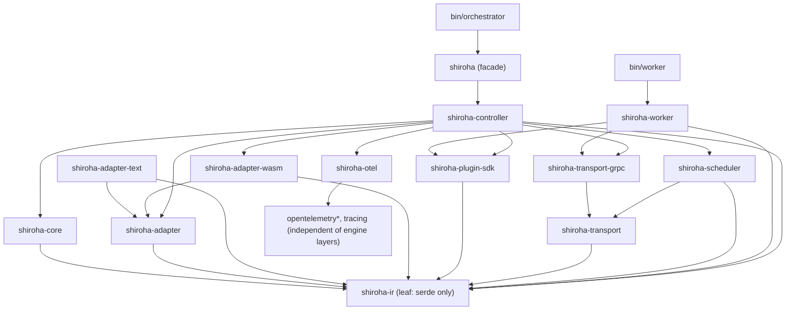

# Research: Cargo Workspace Layout

- **Query**: Recommend a Cargo workspace structure for the 3 layers + adapters + plugins + worker + controller, given the single-orchestrator + stateless-worker topology; justify the split and dependency direction (no circular deps; core depends on nothing upstream).
- **Scope**: internal analysis (informed by the decided architecture) 
- **Date**: 2026-06-25

## Findings

### Design goals for the split

1. **Layer boundaries mirror the architecture** (L1 engine+adapters, L2 scheduler, L3 controller) so each layer's contract is a crate boundary.
2. **`shiroha-core` depends on nothing upstream** (no wasmtime, no tonic, no tokio runtime, no OTel) — the engine + IR are pure Rust logic, fully testable in isolation.
3. **Heavy/risky deps are localized**: wasmtime lives only in `shiroha-adapter-wasm` (+ worker); tonic/prost only in `shiroha-transport-grpc`; OTel only in `shiroha-otel`.
4. **Adapters are pluggable and independent**: text adapters share only `shiroha-ir`; the wasm adapter is the only crate pulling wasmtime.
5. **No circular dependencies** — dependency direction is strictly downward (facade → layers → core/ir).
6. **Worker is a thin binary** that reuses action-execution crates but not the engine.

### Recommended workspace

```
shiroha/                       (Cargo workspace root, virtual manifest)
├── crates/
│   ├── shiroha-ir/            # canonical SmIr types (serde-derived); ActionRef enum; no heavy deps
│   ├── shiroha-core/          # L1 engine: hierarchical+parallel statecharts, RTC transition step,
│   │                          #   transition-path cache, in-flight action/completion-event queue.
│   │                          #   Depends on: shiroha-ir. NO wasmtime/tokio/tonic/otel.
│   ├── shiroha-adapter/       # Adapter trait (trait Adapter { fn load(&self) -> SmIr })
│   │                          #   + shared adapter utilities. Depends on: shiroha-ir.
│   ├── shiroha-adapter-text/  # JSON/YAML/TOML adapters (serde_json / serde-saphyr / toml).
│   │                          #   Depends on: shiroha-adapter, shiroha-ir, serde backends.
│   ├── shiroha-adapter-wasm/  # WASM Component Model adapter: bindgen! for define()/host caps,
│   │                          #   From<MachineDefComponent> for SmIr, per-action TypedFunc resolution,
│   │                          #   capability-whitelist Linker construction. Depends on: shiroha-adapter,
│   │                          #   shiroha-ir, wasmtime (component-model, component-model-async, async).
│   ├── shiroha-plugin-sdk/    # Plugin/capability ABI: host-func capability trait, capability registry,
│   │                          #   semver major-version negotiation types, {plugin, cap.method} ref shape.
│   │                          #   Pure types/traits (no wasmtime). Depends on: shiroha-ir.
│   ├── shiroha-scheduler/     # L2 distributed scheduler: dispatch unit = distributed action, fan-out,
│   │                          #   aggregation (all/any/quorum/first-success), correlator over results.
│   │                          #   Depends on: shiroha-ir, shiroha-transport (trait), tokio/futures.
│   ├── shiroha-transport/     # abstract Transport trait + ActionDispatch/ActionResult domain types.
│   │                          #   NO tonic/prost. Depends on: shiroha-ir, futures, async-trait.
│   ├── shiroha-transport-grpc/# default tonic gRPC Transport impl + Dispatch bidi proto/prost types
│   │                          #   + trace-context inject/extract. Depends on: shiroha-transport,
│   │                          #   tonic, prost, tokio.
│   ├── shiroha-worker/        # stateless action executor: receives ActionDispatch, runs the action
│   │                          #   (wasm via wasmtime, or shell/http), returns ActionResult. Library crate.
│   │                          #   Depends on: shiroha-ir, shiroha-plugin-sdk, wasmtime (action exec),
│   │                          #   shiroha-transport-grpc (server side), tokio.
│   ├── shiroha-otel/          # OTel setup: tracing subscriber + OTLP exporter + context propagation
│   │                          #   helpers. Depends on: opentelemetry* 0.32, tracing-opentelemetry 0.33,
│   │                          #   tracing. (No dep on engine layers.)
│   ├── shiroha-controller/    # L3 controller: task CRUD/pause/resume/query, multi-instance engine
│   │                          #   hosting, auth (token/api-key), action-capability validation, embeds
│   │                          #   L1 engine + L2 scheduler. Depends on: shiroha-core, shiroha-scheduler,
│   │                          #   shiroha-adapter*, shiroha-plugin-sdk, shiroha-transport-grpc,
│   │                          #   shiroha-otel, shiroha-ir.
│   └── shiroha/               # facade crate: re-exports a batteries-included default (controller +
│                              #   default adapters + grpc transport + otel) for GUI/CLI/Web embedding.
│                              #   Depends on: shiroha-controller (+ the default stack).
├── bin/
│   └── shiroha-orchestrator/  # single-orchestrator binary (R6.5): assembles controller+scheduler+
│                              #   engine+grpc transport, runs the tokio runtime. Depends on: shiroha.
│   └── shiroha-worker-bin/    # stateless worker binary: runs shiroha-worker as a gRPC server.
│                              #   Depends on: shiroha-worker.
└── proto/                     # shiroha/scheduler/v1 dispatch.proto (+ tonic-build in build.rs)
```

### Dependency direction (DAG, no cycles)


- **`shiroha-ir` is the universal leaf** — every layer depends on it, it depends on nothing but `serde`. This is the IR contract (AC2).
- **`shiroha-core` depends only on `shiroha-ir`** — engine is pure logic, no async runtime / no wasmtime / no network. Honors "core depends on nothing upstream."
- **wasmtime is confined to `shiroha-adapter-wasm` + `shiroha-worker`** (action execution). The engine, scheduler trait, and controller never import wasmtime directly.
- **tonic/prost confined to `shiroha-transport-grpc`** (+ worker's server side). `shiroha-transport` (trait) is prost-free → libp2p/QUIC impls don't pull tonic.
- **OTel confined to `shiroha-otel`**; everything else uses `tracing` only.

### Why this granularity (vs coarser)

- **Separate `shiroha-ir` from `shiroha-core`**: text adapters can depend on the IR without pulling the engine; lets `shiroha-adapter-text` stay wasmtime-free and engine-free (small, fast-to-compile, fuzzable).
- **Separate `shiroha-adapter` (trait) from concrete adapters**: the controller depends on the *trait* so it can accept any adapter; concrete adapters are plugged in by the facade/binary. Enables a future SCXML/JSON-schema adapter with zero core changes.
- **Separate `shiroha-transport` (trait) from `shiroha-transport-grpc`**: the scheduler depends on the trait, not tonic → testable with an in-process fake `Transport`; libp2p/QUIC swap is one crate.
- **`shiroha-otel` standalone**: isolates the fast-moving 0.x OTel upgrades (see `05-observability.md`) from the rest of the workspace; only this crate re-pins `opentelemetry`/`tracing-opentelemetry`.
- **`shiroha` facade**: GUI/CLI/Web embeds one crate and gets the working default; power users can depend on `shiroha-controller` directly and swap adapters/transport.

### Feature-flag strategy (per crate)

- `shiroha-adapter-wasm`: features `async` (default), `component-model-async` (default), `cache`.
- `shiroha-transport-grpc`: `tls-ring` / `tls-aws-lc` / `tls-native-roots` / `tls-webpki-roots` (off by default; enable for R5.5 TLS).
- `shiroha-otel`: `otlp-grpc` (default), `otlp-http`, `stdout` (debug), `metrics` (on; reflects OTel metrics maturity caveat).
- `shiroha` facade: `default = ["text-adapters", "wasm-adapter", "grpc-transport", "otel-otlp"]`; allow disabling each to slim the dep graph (e.g. `--no-default-features --features text-adapters` for a wasm-free build).

### Recommendation

Adopt the 12-crate workspace above. Key invariants to enforce in `design.md`:
1. `shiroha-ir` = serde-only leaf (the IR contract).
2. `shiroha-core` depends only on `shiroha-ir` (pure engine, no runtime/wasmtime/network).
3. wasmtime ≤ 2 crates (`adapter-wasm`, `worker`); tonic/prost ≤ 2 crates (`transport-grpc`, `worker`); OTel = 1 crate (`otel`).
4. Every "pluggable" boundary (adapter, transport) is a trait crate + ≥1 default impl crate.
5. Facade `shiroha` + two binaries at the top; nothing depends upward.

**Runner-up layout**: fold `shiroha-ir` into `shiroha-core` (fewer crates) — acceptable if compile-time/module-count is a concern, but it costs the "text adapters avoid the engine" property. Prefer keeping them separate.

### Risks / Caveats

- 12 crates is a lot of `Cargo.toml` overhead; mitigated by a workspace-level `[workspace.dependencies]` block pinning shared versions (serde, tokio, wasmtime, opentelemetry*, tracing, anyhow, thiserror) so crates reference `workspace = true`.
- Keep `shiroha-plugin-sdk` pure-trait (no wasmtime) so capability negotiation types are reusable on both host and (conceptually) tooling sides; the *wiring* of host funcs into a wasmtime `Linker` lives in `shiroha-adapter-wasm`, which implements the plugin-sdk traits over wasmtime types.
- Binaries under `bin/` (not `crates/`) to keep them out of library feature resolution.

## External References

- (Internal analysis; informed by decided topology R6.5 and crate evaluations in `01`–`05`.)

## Related Specs

- None yet; feeds AC1/AC8 (layer boundaries + child-task split) in `design.md`.
