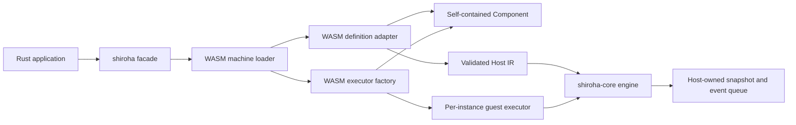

# Shiroha v0.1 Technical Design

## 1. Scope

This design covers the v0.1 local runtime only:

- Host-owned finite-state-machine execution;
- one WASM Component definition adapter;
- in-component WASM guards/actions/callbacks;
- canonical WIT and Rust guest SDK;
- async Rust Host APIs;
- deterministic event processing, atomic commit, limits, tracing, tests, and
  benchmarks.

Controller, Node, scheduler, `sctl`, WASI, text adapters, and dynamic plugins
are future consumers of the boundaries defined here, not placeholder v0.1
services.

## 2. Design Principles

1. **The Host owns semantics.** Guest code supplies data and functions; it does
   not run the transition loop.
2. **IR is runtime-neutral.** `shiroha-core` never exposes Wasmtime/WIT types.
3. **Adapters and executors are different concerns.** An adapter loads a
   definition; an executor invokes a referenced function kind.
4. **Committed state is explicit.** Guest memory is disposable and is never the
   task snapshot.
5. **One deterministic order.** v0.1 avoids configurable lifecycle variants.
6. **No ambient authority.** The v0.1 Component world has no WASI imports.
7. **Measure the hot path.** Preparation is explicit so event dispatch never
   recompiles/revalidates an artifact.

## 3. Workspace Layout

```text
wit/
  shiroha-machine/
    world.wit                  # canonical unversioned pre-v1 WIT package
crates/
  shiroha-core/                # IR, validation, engine, traits, errors
  shiroha-adapter-wasm/        # Wasmtime loader and WASM function executor
  shiroha-guest/               # Rust guest bindings/helpers
  shiroha/                     # public facade composing core + WASM adapter
    examples/
      local-runner.rs          # Host library usage example, not a CLI product
components/
  example-machine/             # standalone no-WASI Rust Component fixture
spikes/
  no-wasi-component/           # removed or folded into fixtures after Phase 0
  no-wasi-host/                # minimal empty-linker validation spike
```

`components/example-machine` should be excluded from normal Host workspace
builds if target-specific generated bindings cannot compile for the Host. The
no-WASI build spike decides whether it can safely remain a workspace member.

The `shiroha` facade is the primary user dependency. Lower-level crates remain
public enough for advanced embedding but do not duplicate facade behavior.

## 4. Architecture



The public load operation returns a prepared artifact containing:

- immutable validated Host IR;
- an executor factory bound to the compiled Component; and
- preparation metadata used for tracing and benchmarks.

Creating a machine instance asks the factory for a disposable guest executor
and creates a Host snapshot/event queue. Multiple instances may share the same
compiled/prelinked Component but never share committed task state.

## 5. Core Domain Model

### 5.1 Identifiers

Use validated newtypes rather than raw strings in engine code:

- `MachineId`
- `StateId`
- `EventName`
- `FunctionId`
- `ActionKind`
- `InstanceId`

Conversion from WIT/text input validates non-empty values, length limits, and
the permitted character set once during loading.

### 5.2 Payloads And Inputs

```rust
pub struct PayloadEnvelope {
    pub bytes: Arc<[u8]>,
    pub content_type: String,
    pub schema_id: Option<String>,
}

pub struct Event {
    pub name: EventName,
    pub payload: Option<PayloadEnvelope>,
}

pub enum HostInput {
    Event(Event),
    Timeout { key: String, payload: Option<PayloadEnvelope> },
    Cancel { reason: Option<PayloadEnvelope> },
}
```

Logical timeout signals participate in transition matching. A cancellation
input may be handled by an explicit cancellation transition; otherwise the Host
commits only the lifecycle change to `cancelled`. Runtime wall-clock deadline
expiration is a fault and is distinct from a logical timeout input.

### 5.3 Definition IR

```rust
pub struct MachineDefinition {
    pub id: MachineId,
    pub initial: StateId,
    pub states: Vec<StateDefinition>,
}

pub struct StateDefinition {
    pub id: StateId,
    pub entry: Option<FunctionRef>,
    pub exit: Option<FunctionRef>,
    pub terminal: Option<TerminalKind>,
    pub transitions: Vec<TransitionDefinition>,
}

pub struct TransitionDefinition {
    pub trigger: Trigger,
    pub guard: Option<FunctionRef>,
    pub action: Option<FunctionRef>,
    pub target: StateId,
    pub failure_target: Option<StateId>,
}

pub struct FunctionRef {
    pub kind: ActionKind,
    pub locator: FunctionId,
}
```

`ValidatedMachine` converts the ordered input vectors into immutable indexes:

- state ID to state index;
- per-state trigger to ordered transition indexes; and
- logical function declarations by kind/locator.

Transition ordering remains the declaration order even after indexing.

### 5.4 Snapshot And Lifecycle

```rust
pub struct MachineSnapshot {
    pub instance_id: InstanceId,
    pub sequence: u64,
    pub state: StateId,
    pub context: PayloadEnvelope,
    pub lifecycle: Lifecycle,
}

pub enum Lifecycle {
    Active,
    Completed,
    Failed(FaultRecord),
    Cancelled(CancelRecord),
}
```

Quiescence is an active machine with an empty internal-event queue, not a
separate durable lifecycle state.

## 6. Adapter And Executor Contracts

### 6.1 Definition Adapter

The adapter consumes opaque artifact bytes and returns only domain data:

```rust
#[async_trait]
pub trait DefinitionAdapter: Send + Sync {
    async fn load_definition(
        &self,
        artifact: ArtifactBytes,
        limits: &LoadLimits,
    ) -> Result<MachineDefinition, AdapterError>;
}
```

The exact trait may accept a prepared adapter-specific artifact to avoid
double compilation, but its observable output remains `MachineDefinition`.

### 6.2 Function Executor

```rust
#[async_trait]
pub trait FunctionExecutor: Send {
    async fn evaluate_guard(
        &mut self,
        function: &FunctionRef,
        input: GuardInput,
        limits: &InvocationLimits,
    ) -> Result<bool, RuntimeFault>;

    async fn invoke_callback(
        &mut self,
        function: &FunctionRef,
        input: HookInput,
        limits: &InvocationLimits,
    ) -> Result<HookEffects, RuntimeFault>;

    async fn invoke_action(
        &mut self,
        function: &FunctionRef,
        input: HookInput,
        limits: &InvocationLimits,
    ) -> Result<ActionOutcome, RuntimeFault>;
}

pub trait FunctionExecutorFactory: Send + Sync {
    fn create(&self) -> BoxFuture<'static, Result<Box<dyn FunctionExecutor>, RuntimeFault>>;
}
```

The engine dispatches by `ActionKind`. v0.1 registers only the component-scoped
WASM kind. A future registry can add HTTP, shell, remote, or plugin kinds
without changing the definition adapter or transition engine.

### 6.3 Prepared Machine

The facade coordinates the adapter and executor factory:

```rust
pub struct PreparedMachine {
    definition: Arc<ValidatedMachine>,
    executor_factory: Arc<dyn FunctionExecutorFactory>,
    metadata: PreparationMetadata,
}
```

This convenience object does not collapse the conceptual adapter/executor
boundary; it only guarantees both were derived from the same Component bytes.

## 7. WIT Contract

Use one unversioned pre-v1 package and world with no imports:

```wit
package shiroha:machine;

world machine-component {
    export definition;
    export functions;
}
```

### 7.1 Control Types

The canonical types interface defines:

- `payload { data: list<u8>, content-type: string, schema-id: option<string> }`
- events and Host signals;
- machine/state/transition/function declarations;
- guard, hook, and action inputs;
- hook effects containing optional replacement context and internal events;
- action outcomes `succeeded(effects)` and
  `failed { code, payload, effects }`; and
- typed guest/load errors.

### 7.2 Fixed Dispatcher Exports

The Component exports fixed functions instead of dynamically named WIT
exports:

```wit
interface definition {
    get-machine: func() -> result<machine-definition, guest-error>;
}

interface functions {
    evaluate-guard: func(id: string, input: guard-input)
        -> result<bool, guest-error>;
    invoke-callback: func(id: string, input: hook-input)
        -> result<hook-effects, guest-error>;
    invoke-action: func(id: string, input: hook-input)
        -> result<action-outcome, guest-error>;
}
```

The definition includes a function catalog so the Host can reject missing,
duplicate, or kind-mismatched logical IDs before startup. The Rust guest SDK
provides dispatcher helpers so component authors implement Rust functions or a
trait map instead of hand-writing string matching.

## 8. Validation

Loading performs all structural checks before a machine can start:

- machine, state, event, and function ID validity/limits;
- unique state/function IDs;
- the initial state exists and terminal-state invariants are valid;
- all normal/failure targets exist;
- failure targets appear only on transitions with actions;
- referenced function kind/ID exists and matches guard/action/callback use;
- terminal states have no outgoing transitions;
- definition, state, transition, and payload counts stay below load limits; and
- WIT payload content type/schema fields meet length constraints.

Unreachable states are reported as validation warnings, not hard errors, in
v0.1. Warnings are returned in `PreparationMetadata` and emitted through
tracing.

## 9. Execution Algorithm

### 9.1 Startup

1. Create a disposable executor and stage the caller-provided initial context.
2. Invoke the initial state's entry callback when present.
3. On success, create and return sequence `0` as `Active` or the initial
   terminal outcome.
4. On fault, return `StartError` containing the attempted initial state/context
   and fault. No `MachineInstance` or committed snapshot is created.

### 9.2 Dispatch And Run-To-Completion

```text
queue external input
while queue not empty:
  check deadline and microstep budget
  pop FIFO input
  find ordered candidate transitions for current state + trigger
  evaluate guards until the first true result
  if none: record UnhandledEvent and continue
  clone references to committed snapshot into a staged step
  invoke exit callback
  invoke action (or synthesize success when absent)
  select normal/failure target
  invoke target entry callback
  commit state/context/lifecycle/sequence
  append staged internal events FIFO
return RunReport at quiescence/terminal/fault
```

Only small metadata is copied to begin a stage. Payload bytes use shared owned
storage on the Host; crossing the canonical ABI may still require a copy.

### 9.3 Fault Handling

Any runtime fault:

1. discards staged context and events;
2. retains the last committed state/context/sequence;
3. marks the task `Failed` or `Cancelled` as appropriate;
4. drops the guest executor after traps/resource faults so later inspection
   cannot accidentally re-enter a poisoned instance; and
5. records whether external guest side effects may have occurred.

Automatic restart/retry is absent in v0.1. Instance recreation is used only by
explicit caller-controlled recovery/tests and must start from the Host snapshot.

## 10. Wasmtime Runtime

### 10.1 Engine And Preparation

Create one reusable Wasmtime `Engine` configured with:

- Component Model support;
- Wasmtime async support used by generated typed calls;
- fuel consumption; and
- epoch interruption.

`WasmMachineLoader::prepare(bytes)`:

1. compiles the Component once;
2. creates a linker with no WASI interfaces;
3. creates an `InstancePre` to resolve imports/type matching once;
4. creates a limited temporary Store/instance;
5. calls `definition.get-machine`;
6. converts WIT values to Host IR and validates it; and
7. returns `PreparedMachine` holding the validated IR and an executor factory
   backed by the Component/`InstancePre`.

### 10.2 Per-Instance Store

Each local machine owns one Wasmtime Store and instance. Store data contains:

- `StoreLimits`;
- current invocation kind/function ID for diagnostics;
- deadline/fuel metadata; and
- a poison/recreate marker.

The implementation may reuse the instance between calls for the warm path.
Tests must prove that recreating it between committed steps preserves behavior.

### 10.3 Limits

Initial finite defaults, subject to calibration in the implementation spike:

| Limit | Initial default |
|---|---:|
| Fuel per guest call | 10,000,000 units |
| Guest wall time per call | 1 second |
| Linear memory per Store | 64 MiB |
| Payload envelope data | 1 MiB |
| Internal events emitted per hook | 256 |
| Run-to-completion microsteps | 1,024 |

Use `StoreLimitsBuilder` for memory/table/instance limits, `Store::set_fuel` for
deterministic CPU accounting, and epoch deadlines for coarse interruption. A
Tokio deadline controls the public future, but dropping a timed-out future is
not considered sufficient; epoch interruption must cause guest execution to
trap.

One process-level epoch ticker is owned by the WASM runtime and shuts down with
it. Do not spawn one untracked ticker per machine or invocation.

### 10.4 Error Classification

Map Wasmtime errors by typed downcast/source inspection where possible:

- fuel exhaustion;
- epoch interruption/deadline;
- memory/table/instance limit;
- guest trap;
- canonical ABI/type mismatch; and
- instantiation/link failure.

Do not classify errors by matching human-readable strings. Unknown Wasmtime
errors become a typed `RuntimeFaultKind::Engine` retaining the source chain.

## 11. Public Host API

Proposed facade shape:

```rust
let runtime = ShirohaRuntime::builder()
    .limits(RuntimeLimits::default())
    .build()?;

let prepared = runtime.prepare_component(bytes).await?;
let mut machine = prepared.start(initial_context).await?;
let report = machine.dispatch(event).await?;
let snapshot = machine.snapshot();
```

Key types:

- `ShirohaRuntime`: owns Wasmtime engine/ticker/global configuration;
- `PreparedMachine`: immutable validated definition plus executor factory;
- `MachineInstance`: Host snapshot, queue, and one guest executor;
- `RuntimeLimits`/`LoadLimits`: finite, validated configuration;
- `RunReport`: start/end snapshot metadata, transition summaries, unhandled
  inputs, terminal/fault outcome, and counters; and
- typed load/start/dispatch errors.

`MachineInstance::dispatch(&mut self, ...)` uses exclusive mutable access to
prevent concurrent dispatch without an internal mutex. Callers that need shared
ownership choose their own async mutex/actor boundary.

Run reports contain bounded summaries rather than an unbounded copy of every
payload. Detailed data remains available through tracing or an explicit bounded
observer hook added later.

## 12. Errors And Diagnostics

Library crates use `thiserror` and typed public errors. `anyhow` is restricted
to binaries/examples/tests where erasure is appropriate.

Primary error groups:

- `LoadError`
- `ValidationError` with multiple path-addressed issues
- `StartError`
- `DispatchError`
- `RuntimeFault`/`RuntimeFaultKind`
- `BusinessFailure`

Every guest call diagnostic includes machine ID, instance ID, state ID,
function ID/kind, input trigger, snapshot sequence, fuel/deadline limits, and
whether the current step committed.

## 13. Observability

Libraries emit `tracing` spans/events but do not install a subscriber.

Required spans:

- `shiroha.prepare`
- `shiroha.validate`
- `shiroha.start`
- `shiroha.dispatch`
- `shiroha.step`
- `shiroha.guest.guard`
- `shiroha.guest.action`
- `shiroha.guest.callback`

Record IDs and counters as structured fields; never record payload bytes by
default. The later Controller can attach an OpenTelemetry-compatible tracing
subscriber/exporter without changing Core instrumentation.

## 14. Build And Guest Tooling

The first implementation checkpoint proves this no-WASI pipeline:

1. generate Rust guest bindings from the canonical WIT with `wit-bindgen`;
2. compile the example for `wasm32-unknown-unknown`;
3. wrap it with `wasm-tools component new`;
4. inspect/validate the Component; and
5. instantiate it with no WASI linker entries.

If `std` introduces unwanted imports, `shiroha-guest` and the fixture use
`no_std + alloc`. Do not fall back to WASIp2 merely to make the fixture build;
that would violate the approved v0.1 scope.

Expected infrastructure changes:

- add `wasm32-unknown-unknown` to Rust/Nix targets;
- install/pin `wasm-tools` in development tooling;
- replace aspirational `justfile` package commands with commands matching
  actual crates and the proven fixture build; and
- remove or feature-gate v0.1 runtime reliance on `wasmtime-wasi`.

## 15. Testing And Benchmarks

### Unit Tests

- ID and definition validation;
- deterministic transition ordering;
- guard/action/callback lifecycle order;
- normal/failure target routing;
- atomic commit/discard;
- FIFO internal events and microstep limit;
- unhandled events;
- terminal/cancellation behavior; and
- mock executor instance recreation.

### WASM Integration Tests

- valid example definition and full local run;
- missing/duplicate logical functions;
- guest-declared errors and action business failures;
- guest trap;
- fuel exhaustion/infinite loop;
- memory limit;
- oversized input/output payload;
- wall-time interruption; and
- same-release Component shape mismatch diagnostics.

### Benchmarks

- indexed Host transition selection with no guest calls;
- Host step with mock executor;
- warm Wasmtime guard/callback/action calls;
- Component compilation; and
- `InstancePre` instantiation.

Use a criterion-style harness with inputs checked into the repository. Record
the reference hardware/toolchain and set a regression threshold only after the
first stable baseline.

## 16. Compatibility And Roadmap

v0.x WIT/IR is intentionally unversioned and may break. Documentation requires
Host and Component artifacts from the same Shiroha release/revision. v1 must
introduce explicit package/IR versioning before claiming production stability.

Future Controller/Node work reuses:

- `MachineDefinition` and snapshots as the controller-owned workflow state;
- `FunctionRef.kind` to select local/plugin/remote executors;
- `ActionOutcome` for remote and aggregated results;
- async `FunctionExecutor` for node dispatch;
- tracing spans for OpenTelemetry; and
- the Host-owned snapshot rule for stateless nodes and migration.

## 17. Trade-Offs

- Full context replacement is simpler and codec-neutral but copies large
  payloads across the canonical ABI.
- One Component per machine delays reusable cross-component actions but avoids
  premature dependency resolution/plugin lifecycle design.
- Host-owned state enables recovery/migration but forbids relying on guest
  globals for workflow correctness.
- Async-first APIs anticipate remote execution but add a runtime/future boundary
  to an otherwise local v0.1 engine.
- No pre-v1 versioning maximizes iteration speed but requires same-release
  Host/Component artifacts and provides no migration promise.

## 18. Rollback Boundaries

- The no-WASI build proof is a hard gate. If it fails, revise guest tooling
  before implementing the adapter; do not weaken the runtime contract silently.
- `shiroha-core` must pass all tests using a mock executor before Wasmtime is
  integrated. If the Wasmtime layer forces IR changes, return to design review.
- WIT is committed only after a minimal Host and guest round trip proves all
  required types lower/lift correctly with the pinned versions.
- Performance optimizations may change internal indexing/ownership but must not
  change the deterministic lifecycle contract without returning to planning.
