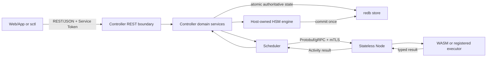

# Roadmap Documentation Design

## 1. Purpose And Boundary

This design explains how to turn the approved product decisions in `prd.md`
into a public, maintainable `ROADMAP.md`. It also records the dependency logic
behind the version sequence so later contributors do not reorder releases by
version-number aesthetics or copy scope from deleted prototypes.

This task changes documentation only:

- add root `ROADMAP.md`;
- add a concise README link and keep its pre-v1 summary aligned; and
- retain this task's PRD/design/implementation evidence.

It does not create future tasks, change workspace versions, scaffold crates,
or implement any roadmap capability.

## 2. Evidence Hierarchy

When sources conflict, use this order:

1. Current executable code, tests, manifests, and generated-by-code contracts.
2. Current README and active `.trellis/spec/` contracts.
3. The archived v0.1 foundation PRD/design/implementation evidence.
4. Product decisions explicitly confirmed by the user in this roadmap task.
5. Deleted pre-remake roadmaps and prior session discussions, used only for
   rationale and ideas that still agree with items 1-4.

The current `Cargo.toml` and README prove that v0.1.0 is the active baseline.
The 41-test run proves the baseline still executes. The old roadmap's claims
that other versions were complete must not appear in the public artifact.

The selected `redb` version is intentionally not pinned in the roadmap.
Implementation research must choose and lock a version when v0.3 starts.
Upstream currently describes `redb` as a stable, crash-safe ACID embedded store
with a stable file format; Shiroha still owns schema versioning, migration,
backup, restore, retention, and recovery correctness.

## 3. Artifact Ownership

| Artifact | Audience | Owns | Must Not Own |
|---|---|---|---|
| `ROADMAP.md` | users and contributors | release goals, scope, gates, task candidates, post-v1 boundary | internal Trellis procedure, implementation status without evidence |
| `README.md` | first-time users | current-version summary and link to roadmap | duplicate detailed release plan |
| `prd.md` | task reviewers | approved requirements and acceptance | code-level execution checklist |
| `design.md` | maintainers | evidence model, dependencies, boundary flows, release rationale | completed-status claims |
| `implement.md` | task executor | ordered documentation edits and validation | future product implementation |

The README remains concise. `ROADMAP.md` is the single public owner of the full
release sequence, avoiding two independently edited plans.

## 4. Dependency Model

```mermaid
flowchart LR
    V01["v0.1.0: local library"] --> V02["v0.2.0: local executable"]
    V02 --> V03["v0.3.0: HSM + redb + REST"]
    V03 --> V04["v0.4.0: trust + capabilities"]
    V04 --> V05["v0.5.0: remote Node execution"]
    V05 --> V06["v0.6.0: reliable scheduling + aggregation"]
    V06 --> V07["v0.7.0: adapters + plugins"]
    V07 --> V08["v0.8.0: operations + packaging"]
    V08 --> V09["v0.9.0: freeze + release candidate"]
    V09 --> V10["v1.0.0: production contract"]
```

The order is intentional:

1. An executable arrives before platform abstraction so every later feature
   has a process-level integration surface.
2. HSM semantics arrive before durable snapshot/schema design. Otherwise the
   persistence model would immediately require disruptive migration.
3. Local durability and a complete REST lifecycle arrive before distributed
   execution, giving the Controller an authoritative recovery boundary.
4. Authentication and Capability Profiles arrive before a remote Node can
   execute work.
5. One remote Action works before retries, fan-out, aggregation, and advanced
   placement multiply failure states.
6. Real distribution informs the plugin interfaces; registries are not guessed
   before transport and aggregation have executable consumers.
7. Operational artifacts precede freeze so release-candidate testing exercises
   the same binaries, images, configuration, and deployment paths users get.
8. v0.9 adds no new product theme. It freezes contracts and proves upgrades.

## 5. Cross-Layer Runtime Flow

The roadmap must preserve one typed owner at every boundary:

| Boundary | Contract Owner | Validation Owner | Compatibility Gate |
|---|---|---|---|
| Web/App -> Controller | OpenAPI + REST DTO module | REST boundary | v0.9 public REST freeze |
| Controller -> domain | shared domain types | service layer | internal, tested per release |
| Controller -> `redb` | versioned storage records | persistence adapter | schema migration matrix |
| Controller -> Node | Protobuf package | both gRPC boundaries | v0.9 protocol freeze |
| Node -> executor | executor registry/SPI | Node + executor adapter | v0.7 extension conformance |
| Host -> machine Component | canonical WIT | WASM adapter | v0.9 WIT/IR freeze |
| Host -> Action/Aggregator Component | focused component WIT/SDK | component adapter | v0.9 SDK/WIT freeze |
| runtime -> telemetry | semantic span/metric catalog | instrumentation layer | v0.8 dashboards/runbooks |

Core remains unaware of REST, gRPC, `redb`, Service Tokens, Controller roles,
or Node placement. Host-owned state and staged atomic commits remain the
semantic center. The Controller orchestrates persistence and distribution
around that contract.

## 6. Release Design

### 6.1 v0.1.0: Completed Foundation

Public status: completed.

Evidence to summarize:

- four current workspace crates and canonical WIT;
- flat deterministic FSM and atomic Host state;
- Wasmtime/WASIp2 adapter and guest SDK;
- finite limits, structured diagnostics, example and benchmarks; and
- 41 passing tests from the current baseline run.

No deleted daemon, scheduler, HSM, persistence, or plugin implementation may be
listed as current.

### 6.2 v0.2.0: First Local Executable

Primary proof: a user can install `shirohad` and `sctl`, load the example
Component, create/start a task, send an event, inspect committed state, and stop
the task entirely through the local REST surface.

Future task candidates:

1. Define executable/configuration boundaries and add `shirohad` local mode.
2. Implement an in-memory Controller task manager around the public facade.
3. Add the minimal loopback/local REST lifecycle and typed error envelope.
4. Add the basic `sctl` client and machine-readable output mode.
5. Add signal handling, graceful shutdown, safe structured logs, and
   process-level end-to-end tests.

Release gates:

- existing v0.1 tests and benchmarks do not regress materially;
- the sample workflow completes through `sctl` against a separate process;
- concurrent requests cannot reenter one machine instance;
- invalid artifacts, requests, limits, and terminal dispatches remain typed;
- shutdown does not accept new work and terminates all owned tasks cleanly; and
- no persistence/distributed/security placeholder API is exposed.

### 6.3 v0.3.0: Durable HSM Controller

Primary proof: a nested-state workflow survives Controller restart from a real
`redb` file and continues through the complete versioned REST API.

Ordered future task candidates:

1. Specify HSM semantics and extend Host IR, WIT, validation, snapshots, guest
   SDK, adapter conversion, engine, examples, tests, and benchmarks together.
2. Define versioned durable domain records independently of Rust private layout.
3. Implement the `redb` adapter, atomic task/snapshot commits, schema metadata,
   migrations, integrity checks, backup, and restore.
4. Implement durable Controller lifecycle/recovery and single-writer ownership.
5. Complete the REST/OpenAPI resource model, error taxonomy, pagination,
   request idempotency, and compatibility tests.
6. Complete `sctl` lifecycle, inspection, backup/restore, and machine-readable
   commands against REST.

Release gates:

- HSM exit/action/entry, ancestor selection, terminal propagation, internal
  events, timeout/cancel, and failure-target semantics have focused tests;
- acknowledged state is never silently lost in crash/restart fault injection;
- restore recovers the exact active path and authoritative pending work;
- schema migration and backup/restore run against real files;
- REST/OpenAPI and `sctl` cover the same domain operations; and
- Core has no `redb`, HTTP, Controller, or transport dependency.

### 6.4 v0.4.0: Trust And Capability Enforcement

Primary proof: a locally running Controller accepts an authorized task under a
least-privilege Capability Profile and rejects missing, tampered, undeclared,
unsupported, or over-broad authority before execution.

Future task candidates:

1. Add production TLS configuration and rotatable Service Token validation for
   REST, with explicit loopback-only insecure development mode.
2. Define Capability Profile schema, import/capability request metadata, and
   artifact digest binding.
3. Build the configurable Wasmtime/WASI context from resolved grants while
   preserving exact import allowlists and finite limits.
4. Define integrity-protected execution grants and the future Node verification
   contract without implementing remote execution.
5. Add security audit events, hostile fixtures, secret-redaction tests, policy
   reload/validation behavior, and operator documentation.

Release gates:

- production startup rejects unauthenticated non-local REST;
- Service Token rotation/revocation is testable and raw credentials never log;
- capability policy has no allow-all fallback;
- Component imports and actual Host grants match exactly;
- artifact or grant tampering fails closed; and
- application roles remain absent from Controller models and APIs.

### 6.5 v0.5.0: Stateless Remote Execution

Primary proof: one Controller dispatches an explicitly remote Action to an
authenticated stateless Node, receives its typed result, and commits the Host
transition exactly once.

Future task candidates:

1. Define versioned Protobuf services/messages for Node registration,
   heartbeat, capability advertisement, dispatch, cancellation, and results.
2. Implement Controller and Node mTLS identity/configuration lifecycle.
3. Implement Node registration leases and compatibility/capability checks.
4. Implement the stateless Node executor path with bounded concurrency and no
   authoritative workflow state.
5. Route one remote Action through the Controller while preserving Core error,
   business-failure, payload, deadline, and external-effect semantics.

Release gates:

- a real multi-process/multi-host test executes one remote Action end to end;
- unauthenticated, expired, incompatible, or incapable Nodes are rejected;
- Node restart loses no authoritative workflow state;
- disconnect, cancellation, timeout, and late-result behavior are explicit; and
- retry, fan-out, and aggregation remain out of this release.

### 6.6 v0.6.0: Reliable Distributed Scheduling

Primary proof: a fan-out workflow survives injected Controller/Node/network
failures, resumes from `redb`, and reaches the same framework-level outcome
under deterministic replay.

Future task candidates:

1. Add durable Activity state, transactional outbox/inbox processing, result
   deduplication, and attempt history.
2. Implement bounded idempotency-aware retry and explicit unknown outcomes for
   non-idempotent work.
3. Implement heartbeat health, capability/label eligibility, capacity-aware
   placement, round-robin tie-breaking, bounded queues, and backpressure.
4. Add immutable dispatch plans for one, replica-count, and broadcast shapes.
5. Implement `first-success`, `all`, and `quorum(k)` aggregation with complete
   partial-failure semantics.
6. Add the bounded side-effect-free WASM Aggregator contract, SDK path, replay,
   and fault-injection suites.

Release gates:

- lost acknowledgements and duplicate results never double-commit Host state;
- only declared-idempotent Actions retry automatically;
- unknown outcomes block silent progress and are operator-resolvable;
- queue saturation produces backpressure rather than unbounded memory growth;
- dispatch and aggregation recover across Controller restart; and
- documentation makes the at-least-once/no-universal-exactly-once boundary
  prominent.

### 6.7 v0.7.0: Real Extension Platform

Primary proof: the same workflow can be loaded from JSON/TOML, call an
independent WASM Action or the HTTP Action plugin, and use a custom WASM
Aggregator under the same capability and limit system.

Future task candidates:

1. Specify and implement JSON/TOML adapters plus cross-adapter conformance
   fixtures against canonical Host IR.
2. Define versioned startup registry/configuration and supported extension SPIs.
3. Separate and publish the Action/Aggregator Component WIT and Rust SDK.
4. Implement independent WASM Component loading, resolution, limits,
   capability grants, caching, and compatibility diagnostics.
5. Implement and harden the HTTP Action plugin with destination policy,
   deadlines, bounded bodies, idempotency propagation, and tests.

Release gates:

- equivalent definitions produce equivalent validated Host behavior;
- registry errors fail at startup/preparation rather than first production use;
- extension Components cannot escape grants or resource bounds;
- the HTTP plugin passes hostile redirect/DNS/size/timeout/retry tests; and
- excluded plugin types are documented, not represented by stubs.

### 6.8 v0.8.0: Production Operations And Packaging

Primary proof: a release artifact is installed into the supported single
Controller/multi-Node topology, observed under load, backed up, restored,
upgraded, and gracefully shut down using only shipped operational material.

Future task candidates:

1. Define OpenTelemetry span/metric semantics and export integration while
   preserving payload/credential redaction.
2. Add health/readiness, audit export, diagnostics, config validation, and
   actionable failure reporting.
3. Harden graceful drain/shutdown, backup/restore, retention/compaction, and
   disaster-recovery runbooks.
4. Complete and dependency-audit `full`, `controller`, and `node` feature
   builds.
5. Build signed/checksummed binaries, non-root OCI images, SBOMs, signatures,
   and release installation smoke tests for Linux x86_64/aarch64.
6. Ship and test Compose, systemd, and Helm deployment paths plus load, soak,
   leak, and chaos scenarios.

Release gates:

- every shipped artifact is installed and smoke-tested by release CI;
- role builds/images exclude unneeded dependencies and authority;
- dashboards and runbooks diagnose saturation, retry, unknown outcome,
  capability denial, Node loss, and storage health;
- backup/restore and rolling Node replacement are rehearsed; and
- documented load/soak thresholds show no unbounded resource growth.

### 6.9 v0.9.0: Contract Freeze And Release Candidate

Primary proof: a clean deployment can upgrade through the supported path to the
release candidate, run compatibility suites, and roll back according to the
documented boundary without data ambiguity.

Future task candidates:

1. Freeze and SemVer-check public Rust crates, features, MSRV, docs, and
   examples; restructure packages so internal crates remain private.
2. Freeze/version REST/OpenAPI, Node Protobuf, machine/extension WIT, Host IR,
   CLI output/config, and telemetry semantic names.
3. Freeze `redb` schema/migration rules and execute upgrade/backup/restore/
   rollback rehearsals on representative prior files.
4. Run full conformance, fuzz, hostile-input, fault-injection, load, soak,
   supply-chain, licensing, and security review gates.
5. Produce the release-candidate compatibility matrix, operator manuals,
   migration guides, deprecation policy, and final performance baselines.

Release gates:

- no known critical correctness, data-loss, sandbox escape, or auth bypass;
- all public contract compatibility checks are automated;
- all supported artifacts and deployment modes pass end-to-end acceptance;
- upgrade/rollback limits are explicit and rehearsed; and
- no new feature is accepted after freeze without returning to roadmap review.

### 6.10 v1.0.0: Production-Usable Stable Release

Primary proof: promote the unchanged qualified release candidate after every
production-readiness gate is satisfied.

Release tasks are limited to:

1. Final release metadata, signatures, crates, binaries, images, chart, docs,
   and compatibility publication.
2. Clean-environment installation and acceptance verification using published
   artifacts only.
3. Formal v1 support/compatibility declaration and opening of post-v1 planning.

v1 must not absorb a late feature backlog. A failed gate returns work to the
owning pre-v1 milestone or a new release candidate.

## 7. Compatibility And Migration Model

Before v0.9, contracts may change incompatibly, but durable versions from v0.3
onward still need explicit schema identifiers and migration tests. "Pre-v1 may
break" is not permission to corrupt or silently discard state.

At v0.9, independently version:

- public Rust crate APIs and feature flags;
- REST path/media/error contract and OpenAPI;
- Node Protobuf package and capability negotiation;
- machine and extension WIT packages;
- Host IR and serialized durable records;
- `redb` schema/migration level;
- CLI machine-readable output and configuration schema; and
- telemetry semantic conventions.

The public roadmap should state the intended supported upgrade window without
inventing it in detail. v0.9 implementation research must define which pre-RC
versions can upgrade directly, which require an intermediate migration, and
which are explicitly unsupported.

## 8. Production-Readiness Gate Families

`ROADMAP.md` should summarize these cross-cutting v1 gates once, then link each
release to the relevant subset:

| Gate Family | Minimum Evidence |
|---|---|
| Correctness | HSM conformance, atomicity, deterministic replay, hostile inputs |
| Durability | real `redb` crash/restart, migrations, backup/restore, integrity |
| Distribution | leases, backpressure, at-least-once, idempotency, unknown outcomes, aggregation |
| Security | TLS/Service Tokens, mTLS, fail-closed profiles/grants, redaction, audit |
| Operations | telemetry, health, diagnostics, graceful drain, runbooks, alerts |
| Compatibility | Rust/REST/Proto/WIT/IR/schema/config/CLI checks and upgrade rehearsal |
| Supply chain | locked dependencies, license/advisory checks, SBOMs, signatures, provenance |
| Performance | recorded baselines, regression policy, load/soak limits, no unbounded growth |
| Delivery | clean installs of binaries/images/chart and role-specific end-to-end tests |
| Documentation | user, component author, extension author, API, operator, migration guides |

## 9. Future Task Mapping Rules

The public task candidates are a decomposition map, not active Trellis tasks.
When a release begins:

1. Create only the next independently verifiable task.
2. Copy the relevant roadmap requirement and release gate into its PRD.
3. State dependencies explicitly in the child artifact.
4. Require executable evidence before marking the task or roadmap item done.
5. Update `ROADMAP.md` only after the evidence lands on the current branch.

A release may contain many tasks. Version boundaries group a coherent user
capability and validation point; they are not an instruction to create a giant
implementation task.

## 10. Trade-Offs And Risks

- v0.3 is broad. HSM must land before persistence, and durable Controller work
  must be split into ordered tasks rather than one change.
- REST outside and gRPC inside require two wire models. Shared domain types and
  boundary conversion prevent them from drifting into two business semantics.
- `redb` keeps the v1 deployment attainable but intentionally limits the
  Controller to single-authority local storage. It is not disguised HA.
- At-least-once delivery is honest for arbitrary side effects but exposes
  unknown outcomes. Operator resolution is a first-class workflow state, not a
  logging detail.
- Capacity reports are stale by nature. Persist actual placement and use
  backpressure; do not claim globally optimal scheduling.
- Plugin work is delayed until distribution exists, reducing premature SPI
  design but requiring v0.7 to prove real extensions before freeze.
- Helm, images, signatures, SBOMs, and multi-architecture releases add ongoing
  maintenance. They are included because v1 is explicitly production-usable.
- HSM is included before v1, while full Statecharts are deferred to avoid
  multiplying durable/distributed state dimensions before the first stable
  release.

## 11. Roadmap Maintenance Policy

`ROADMAP.md` uses Chinese capability status only: `已完成`, `下一版本`, `进行中`,
or `规划中`. A status change requires a linked release, commit, test report, or
other current-branch evidence. No percentage-complete or date estimate is used.

Scope changes that move a cross-version dependency, expand v1 compatibility,
or add a production deployment promise require a new planning review. Small
wording corrections and links do not.
