# Shiroha 开发路线图

Shiroha 正在从已经完成的 v0.1 本地运行时，逐步演进为稳定、可用于生产环境的
v1 平台。本路线图以能力门禁为依据：只有在行为得到可执行证据验证后，对应版本才算
完成。路线图不包含任何日历时间承诺。

## 状态说明

- **已完成**：已经在当前代码库中实现并通过验证。
- **下一版本**：下一个进入实施阶段的 Release Line。
- **进行中**：已经开始实施，但尚未通过全部发布门禁。
- **规划中**：已按依赖关系排序，尚未开始实施。

下文中的未来任务候选仅用于指导拆分，并不是已经创建的任务。每个版本开始开发时，
应逐个创建可独立验证的垂直切片任务。

## 交付原则

1. **保持 Host 的权威地位。** Component 负责定义状态机并实现函数；Host 负责执行
   顺序、已提交状态、事件队列、校验、限制、持久化协调和调度决策。
2. **交付可执行切片。** 延后的服务和扩展 API 只有在存在真实消费者和端到端验证时
   才能加入。
3. **先稳定语义，再实现存储和分布式。** HSM 行为必须早于其持久化表示；安全的本地
   控制必须早于远程执行；单个远程 Action 必须早于重试和 fan-out。
4. **在信任边界默认拒绝。** 资源限制、Service Token、Node 身份、Component
   Import 和 Capability Profile 必须在工作获得权限前完成校验与执行。
5. **如实描述分布式保证。** 远程执行采用至少一次投递。Shiroha 会去重编排结果，
   但不声称能够为所有外部副作用提供通用的恰好一次执行保证。
6. **只冻结经过验证的合同。** 公共 Rust、REST、Protobuf、WIT/IR、存储、配置、CLI
   和 Telemetry 合同只有在生产路径已经存在后，才会在 v0.9 冻结。

## 版本序列

```mermaid
flowchart LR
    V01["v0.1.0：本地库"] --> V02["v0.2.0：本地可执行程序"]
    V02 --> V03["v0.3.0：HSM + redb + REST"]
    V03 --> V04["v0.4.0：信任与 Capability"]
    V04 --> V05["v0.5.0：远程 Node 执行"]
    V05 --> V06["v0.6.0：可靠调度与聚合"]
    V06 --> V07["v0.7.0：Adapter 与扩展"]
    V07 --> V08["v0.8.0：运维与打包"]
    V08 --> V09["v0.9.0：冻结与发布候选"]
    V09 --> V10["v1.0.0：生产合同"]
```

| 版本 | 状态 | 核心验证点 |
| --- | --- | --- |
| v0.1.0 | 已完成 | 通过 Rust Facade 在本地运行受限的 WASM 定义 FSM |
| v0.2.0 | 下一版本 | `sctl` 驱动由独立本地 `shirohad` 进程托管的工作流 |
| v0.3.0 | 规划中 | 嵌套工作流通过 `redb` 在 Controller 重启后恢复 |
| v0.4.0 | 规划中 | 未授权或权限过大的工作在执行前失败 |
| v0.5.0 | 规划中 | 一个远程 Action 在经过认证的无状态 Node 上执行 |
| v0.6.0 | 规划中 | fan-out 在 Controller、Node 和网络故障后确定性恢复 |
| v0.7.0 | 规划中 | 文本、独立 WASM 和 HTTP 扩展共享同一套受限运行时模型 |
| v0.8.0 | 规划中 | 发布产物按文档完成安装、运维、备份、恢复和升级 |
| v0.9.0 | 规划中 | 冻结合同通过兼容性和升级演练 |
| v1.0.0 | 规划中 | 未经修改的合格发布候选通过全部生产门禁 |

## v0.1.0：核心运行时

**状态：** 已完成

**目标与用户价值：** 在引入平台服务之前，以可嵌入 Rust 库的形式验证 Host/WASM
边界。

**已交付：**

- 仅包含一个活动状态的扁平事件驱动 FSM；
- 按顺序求值的 Guard，以及固定的 exit -> action -> entry 行为；
- 由 Host 持有的 State/Context 原子提交和 FIFO 内部事件；
- 正常、业务失败、超时、取消和未处理输入路径；
- 与具体运行时无关的 Core Adapter/Executor 边界；
- 通过规范 WIT 实现的类型化 Wasmtime Component Model 执行；
- Rust Guest SDK 和 WASIp2 示例 Component；
- 有限的 CPU、Deadline、内存、Payload、事件和微步限制；
- 结构化 Tracing、异步 Facade、基准测试和可运行示例。

**证据：** 当前示例 Component 可以构建，Workspace 的 41 项测试全部通过。验收
证据映射记录在
[`docs/testing/v0.1-acceptance.md`](docs/testing/v0.1-acceptance.md)，热路径
基线记录在
[`docs/benchmarks/v0.1-baseline.md`](docs/benchmarks/v0.1-baseline.md)。

**明确边界：** v0.1 不包含 Controller、持久化、Node、分布式调度器、安装式 CLI、
文本 Adapter、插件系统、Task 授权或可配置 Capability 策略。

## v0.2.0：首个本地可执行版本

**状态：** 下一版本

**目标与用户价值：** 将本地库变为可直接操作的程序，让用户无需编写自定义嵌入应用
即可运行、验证和演示工作流。

**依赖：** v0.1 Host Facade、运行时合同、示例 Component 和结构化错误。

**范围：**

- 添加以本地模式运行当前 Runtime 的 `shirohad` 可执行程序；
- 添加基于内存的 Controller Task 生命周期，支持 Load、Start、输入 Dispatch、
  已提交状态检查和 Stop；
- 暴露刻意保持精简的 Loopback/本地 REST API；
- 添加使用该 REST API 的基础 `sctl` 客户端；
- 提供机器可读的 CLI 输出、进程配置、安全的结构化日志、信号处理和优雅关闭；
- 添加通过 `sctl` 驱动的进程级端到端测试。

**非目标：** HSM、持久化、重启恢复、远程 Node、分布式调度、生产认证、可配置
WASI Grant 和插件。

**验证点：** 在干净环境中启动 `shirohad`，通过 `sctl` 加载示例、创建并驱动 Task
直至完成、检查已提交 Snapshot，最后在没有遗留工作的情况下停止进程。

**发布门禁：**

- 当前 v0.1 测试和基准合同保持不变；
- 并发 REST 请求无法重入同一个状态机实例；
- 无效 Artifact、请求、限制和生命周期操作仍返回类型化错误；
- 关闭过程停止接收新工作，排空或终止已持有工作，并干净退出；
- 日志只包含标识符和有界元数据，绝不包含 Payload 或 Secret；
- 不公开无法测试的持久化、分布式或安全占位 API。

**未来任务候选：**

1. 可执行程序与配置边界。
2. 基于内存的 Controller Task Manager。
3. 最小本地 REST 生命周期和错误 Envelope。
4. 基础 `sctl` 命令和机器可读输出。
5. 关闭、日志和进程级验收测试。

## v0.3.0：持久化 HSM Controller

**状态：** 规划中

**目标与用户价值：** 支持复杂的嵌套工作流，并在 Controller 重启后保留其权威状态。

**依赖：** v0.2 的进程与控制循环。HSM 语义必须在最终确定持久化 Schema 前完成。

**范围：**

- 添加嵌套状态、Initial Child、祖先感知的 Transition 选择、基于最近公共祖先的
  Exit/Entry 路径和 Terminal 传播；
- 在状态路径上保留固定 Hook 顺序、原子提交、内部事件处理、超时/取消和
  Failure Target 行为；
- 在版本化 Snapshot 中显式表示已提交的活动 Leaf/Path；
- 使用 `redb` 作为 v1 前唯一受支持的数据库；
- 持久化 Definition/Artifact 身份、已提交 Snapshot、Pending Work 和恢复元数据，
  不直接序列化 Rust 私有布局；
- 添加显式 Schema 版本、前向迁移、完整性检查、备份/恢复、保留/压缩策略以及真实
  文件恢复测试；
- 完成版本化 REST/JSON Controller 资源模型和 OpenAPI 文档；
- 完成 `sctl` 生命周期、检查、备份和恢复命令。

**非目标：** 远程 Node、自动分布式重试、fan-out、PostgreSQL、SQLite、共享存储、
多 Controller 和完整 Statechart。

**验证点：** 运行一个嵌套工作流，在注入的故障点停止 Controller，通过其 `redb`
文件重启，验证精确的已提交活动路径和 Pending Work，然后继续通过 REST/`sctl`
执行。

**发布门禁：**

- 聚焦的 Conformance Test 覆盖 HSM 选择和 exit/action/entry 顺序；
- 在 Crash/Restart 故障注入中，已确认状态绝不静默丢失；
- Schema 迁移和备份/恢复使用真实 `redb` 文件测试；
- REST/OpenAPI 与 `sctl` 暴露相同的 Domain 生命周期和类型化错误；
- Core 不引入 HTTP、`redb`、Controller 或 Transport 依赖。

**未来任务候选：**

1. HSM IR、WIT、Engine、Guest SDK、示例、Conformance 和基准测试。
2. 版本化持久化 Domain Record 和迁移策略。
3. `redb` Adapter、事务、备份/恢复和完整性工具。
4. 持久化 Controller 所有权和重启恢复。
5. 完整 REST/OpenAPI 合同和兼容性测试。
6. 完整 `sctl` 运维命令。

## v0.4.0：信任与 Capability 强制执行

**状态：** 规划中

**目标与用户价值：** 在引入远程执行边界前，让本地 Task 创建与执行默认拒绝不可信
请求。

**依赖：** v0.3 的持久化 Controller、Artifact 身份、REST 合同和版本化配置。

**范围：**

- 生产 REST 强制使用 TLS 和可配置、可轮换的 Bearer Service Token；Token 仅用于
  建立服务信任，不承载 Shiroha 角色；
- 只有显式启用本地模式时才允许无认证开发；
- 定义由 Operator 管理的 Runtime Sandbox Capability Profile；
- 将每个 Task 请求及解析后的 Profile 绑定到 Artifact Digest；
- 发现 Import，并拒绝未声明、不支持、过期、被篡改或权限过大的请求；
- 根据解析后的 Profile 构建精确且有界的 Wasmtime/WASI Context；
- 签发未来 Node 可以验证、受完整性保护的 Execution Grant；
- 添加安全审计事件、恶意 Fixture、脱敏测试和 Operator 策略文档。

**安全边界：** Web/App 集成负责用户、角色、租户和业务授权。Controller 只负责
可信服务认证、框架输入/状态校验、资源限制和 Capability 强制执行；它不实现 RBAC
或 Identity Provider。

**非目标：** 远程执行、应用用户管理、Controller 角色、OIDC Provider 功能、多租户
和 Fail-open 默认策略。

**验证点：** 通过 REST 提交允许和恶意的 Task 变体；允许的 Task 只能获得其声明的
精确权限，缺失、被修改、不支持或超出范围的 Grant 均在执行前失败。

**发布门禁：**

- 生产启动拒绝未认证的非本地 REST；
- Service Token 轮换/撤销可测试，原始 Token 绝不进入日志；
- Capability 策略不存在 Allow-all 回退；
- 声明 Import、解析后的 Grant 和实际 Host 权限精确一致；
- Artifact/Grant 篡改以及无法执行的 Capability 均默认拒绝；
- Controller API 中不存在应用角色或业务权限模型。

**未来任务候选：**

1. TLS 与 Service Token 生命周期。
2. Capability Profile 和 Artifact Request Schema。
3. Grant 驱动的 Wasmtime/WASI Context 构建。
4. 受完整性保护的 Execution Grant。
5. 审计、恶意 Fixture、脱敏和安全文档。

## v0.5.0：无状态远程执行

**状态：** 规划中

**目标与用户价值：** 在独立且经过认证的 Node 上执行指定 Action，同时让所有权威
工作流状态继续由 Controller 持有。

**依赖：** 持久化 Controller 所有权，以及 v0.4 的信任与 Capability Grant。

**范围：**

- 为注册、Heartbeat、Capability 广告、Dispatch、Cancellation、Progress 和
  Result 定义版本化 Protobuf/gRPC 服务；
- 强制使用具有独立 Node 身份的 mTLS；
- 添加基于 Lease 的 Node 注册，以及版本/Capability 兼容性检查；
- 实现具有有界并发和队列的无状态 Node Executor；
- 通过 Controller 调度路由一个显式远程 Action；
- 保留 Core 的 Business Failure、Runtime Fault、Payload、Deadline、Cancellation
  和 External Effects Possible 语义。

**非目标：** 自动重试、fan-out、聚合、容量优化、高级 Placement 和 Node 上的持久化
工作流状态。

**验证点：** 真实多进程测试将一个 Action 从 Controller Dispatch 到独立 Node，
接收其类型化结果，并且只提交一次 Host Transition。

**发布门禁：**

- 未认证、过期、不兼容或能力不足的 Node 被拒绝；
- Node 重启不会丢失任何权威工作流状态；
- Disconnect、Timeout、Cancellation 和 Late Result 行为均有明确定义；
- 所有由 Guest 和 Node 控制的数据都有界；
- REST 保持对外，Node gRPC 保持内部使用。

**未来任务候选：**

1. 版本化 Node Protobuf 合同。
2. Controller/Node mTLS 身份生命周期。
3. Node Lease 和兼容性广告。
4. 无状态有界 Node Executor。
5. 单个远程 Action 路由和验收测试。

## v0.6.0：可靠分布式调度

**状态：** 规划中

**目标与用户价值：** 让分布式执行可以恢复并适用于副本/fan-out 工作，同时不夸大
外部副作用保证。

**依赖：** 已验证的单个远程 Action 路径和 v0.3 持久化 Controller。

**范围：**

- 为每次执行分配持久化 Activity ID 和 Idempotency Key；
- 在 Dispatch 前以事务方式持久化调度意图，并在推进 Host 状态前去重已接受结果；
- 仅重试显式声明为幂等的 Action，并限制 Attempt、Deadline、Backoff、Jitter，
  同时记录 Attempt History；
- 对无法确认是否产生外部副作用的非幂等工作，暴露可由 Operator 处理的
  `outcome unknown` 状态；
- 将取消视为尽力而为，不声称能够回滚外部副作用；
- 根据 Lease、兼容性、Label、Executor Kind、Capability 和有界容量过滤 Node；
- 优先选择可用容量，并使用 Round-robin 解决并列，同时通过有界 Node 队列提供显式
  Backpressure；
- 为单 Node、显式副本数或全部 Eligible Node 持久化不可变 Dispatch Plan；
- 提供 `first-success`、`all` 和 `quorum(k)` 聚合；
- 提供有界、确定性、无副作用且没有环境 WASI 权限的 WASM Aggregator。

**非目标：** 通用恰好一次外部副作用、Priority、Preemption、复杂 Affinity、资源
Reservation、Autoscaling、流式 DAG 和 MapReduce。

**验证点：** fan-out 工作流在注入 Ack 丢失、重复结果、Node Crash、网络 Timeout
和 Controller 重启后，通过 Replay 得到相同的框架级结果。

**发布门禁：**

- Ack 丢失和重复结果不会导致 Host 状态重复提交；
- 非幂等歧义不会让工作流静默前进；
- Saturation 产生有界 Backpressure，而不是无限内存增长；
- 已选择 Node 和 Aggregation Progress 可从 `redb` 恢复；
- Partial Success、Timeout、Loss、Cancellation、Late Result 和 Duplicate Result
  语义确定且经过测试；
- 文档显著说明至少一次投递，以及不存在通用恰好一次保证。

**未来任务候选：**

1. 持久化 Activity/Outbox/Inbox 状态和结果去重。
2. 幂等感知重试和 `outcome unknown` 处理。
3. Health、Eligibility、容量感知 Placement、队列和 Backpressure。
4. 不可变 Single/Replica/Broadcast Dispatch Plan。
5. 内置聚合和部分失败语义。
6. 有界 WASM Aggregator SDK，以及故障注入/Replay Suite。

## v0.7.0：真实扩展平台

**状态：** 规划中

**目标与用户价值：** 允许用户通过多种真实格式和 Component 边界定义、扩展工作流，
同时不削弱 Host 校验、Capability 或资源限制。

**依赖：** 已验证的 Machine WIT、分布式、聚合和 Capability Profile，使扩展接口
能够从真实消费者中提取，而不是提前猜测。

**范围：**

- 添加可生成规范、已校验 Host IR 的 JSON 和 TOML Definition Adapter；
- 添加版本化、由启动配置填充的 Adapter/Executor Registry；
- 定义并发布独立 WASM Action/Aggregator Component WIT 和 Rust SDK Surface；
- 加载、解析、缓存、限制、诊断并授权独立 Component；
- 交付一个生产质量的 HTTP Action 插件，包含 Destination Policy、Deadline、有界
  Body、Idempotency 传递和安全诊断；
- 记录 Machine Component、Action/Aggregator Component、Adapter、Host-native
  Executor 和 Runtime 之间的兼容性。

**非目标：** 原生 Rust 动态库、Bash、YAML、NATS 插件、热重载、插件市场和广泛的
内置 Action Catalog。

**验证点：** 等价的 WASM/JSON/TOML Definition 产生等价行为，同时在同一套
Capability 和资源策略下调用独立 WASM Action、HTTP Action 和自定义 WASM
Aggregator。

**发布门禁：**

- 跨 Adapter Conformance 证明等价 Host IR 行为；
- 缺失、重复或不兼容的 Registry Entry 在启动或 Preparation 阶段失败，而不是在
  第一次生产调用时失败；
- Extension Component 无法逃逸 Grant 或有限资源边界；
- HTTP 插件通过 Redirect、DNS、Destination、Size、Timeout 和 Retry 安全测试；
- 被排除的插件类型不存在公共 Stub API。

**未来任务候选：**

1. JSON/TOML Adapter 和 Conformance Fixture。
2. 版本化启动 Registry/配置合同。
3. Action/Aggregator Component WIT 和 Rust SDK。
4. 独立 Component 解析、缓存、限制和诊断。
5. 生产质量 HTTP Action 插件。

## v0.8.0：生产运维与打包

**状态：** 规划中

**目标与用户价值：** 使用随项目交付的产物和文档，完成受支持的单 Controller/多
Node 系统安装、观测、恢复和运维。

**依赖：** v1 计划包含的全部 Runtime 和扩展路径。

**范围：**

- 添加兼容 OpenTelemetry 的 Trace 和 Metric 语义，同时保持 Payload 与 Credential
  脱敏；
- 添加 Health/Readiness、Audit Export、Operator 诊断和严格配置校验；
- 加固停止接收新任务、Drain/Shutdown、备份/恢复、保留/压缩和灾难恢复；
- 完成并审计 `full`、`controller` 和 `node` Cargo Feature Build 的依赖；
- 发布带签名和 Checksum 的 Linux x86_64/aarch64 `shirohad` 与 `sctl` 二进制；
- 发布非 Root 角色镜像，包含 SBOM、签名、Health Check 和持久卷路径文档；
- 交付经过测试的 Docker Compose、systemd 和版本化 Helm 部署；
- 对发布产物运行 Load、Soak、Leak、Chaos 和安装 Smoke Test。

**非目标：** Kubernetes Operator、自动 Provisioning/Autoscaling、非 Linux 生产目标
和托管云服务。

**验证点：** 只使用已发布产物完成安装，在负载下运行并诊断注入故障，备份和恢复
Controller，替换 Node，并按照交付 Runbook 干净关闭。

**发布门禁：**

- Release CI 安装并测试实际二进制、镜像和 Chart；
- 角色 Build/Image 排除不需要的依赖与权限；
- Telemetry/Runbook 可以诊断 Saturation、Retry、Unknown Outcome、Policy Denial、
  Node Loss 和 Storage Health；
- 备份/恢复和无状态 Node 滚动替换已经演练；
- Load/Soak 证据表明不存在无限资源增长。

**未来任务候选：**

1. OpenTelemetry 语义目录和 Exporter。
2. Health、Audit、诊断和配置校验。
3. 优雅运维、保留、备份/恢复和 Runbook。
4. 按角色划分的 Feature Build 和依赖审计。
5. 签名二进制/镜像、SBOM、Provenance 和 Release CI。
6. Compose/systemd/Helm，以及 Load/Soak/Chaos 验收。

## v0.9.0：合同冻结与发布候选

**状态：** 规划中

**目标与用户价值：** 只冻结经过验证的公共合同，并演示进入首个稳定版本的安全、
有文档支持的路径。

**依赖：** v1 计划包含的完整 Runtime、安全、扩展、运维和打包 Surface。

**范围：**

- 冻结并对 `shiroha`、`shiroha-core`、`shiroha-guest` 以及独立
  Action/Aggregator SDK Surface 执行 SemVer 检查；
- 保持 Wasmtime、Controller、Node、Scheduler、`redb`、Server 和 Transport 实现
  为内部细节，并在需要时重构 Package；
- 冻结并版本化 REST/OpenAPI、Node Protobuf、Machine/Extension WIT、Host IR、CLI
  机器输出、配置和 Telemetry 语义；
- 冻结 `redb` Schema/迁移行为，并在代表性文件上执行升级、备份、恢复和回滚演练；
- 定义 MSRV、兼容性/弃用策略、受支持升级窗口和兼容性矩阵；
- 运行 Conformance、Fuzz、恶意输入、故障注入、Load、Soak、供应链、License 和
  Security Review 门禁；
- 发布最终性能基线、Operator Manual、Migration Guide 和 Release Candidate 产物。

**非目标：** 新功能主题，或与已删除原型保持兼容。

**验证点：** 将受支持的旧部署升级到 Release Candidate，运行全部兼容性和部署
Suite，并在没有状态歧义的情况下执行文档规定的 Rollback 边界。

**发布门禁：**

- 不存在已知的严重正确性、数据丢失、Sandbox Escape 或认证绕过问题；
- 所有公共合同兼容性检查均已自动化；
- 所有受支持角色 Build 和部署路径均端到端通过；
- 升级/回滚支持范围和限制明确，并经过演练；
- 任何新功能提议都必须返回路线图评审，而不能进入 Release Candidate。

**未来任务候选：**

1. 公共 Crate/Package 重构和 SemVer/MSRV 审计。
2. REST/Protobuf/WIT/IR/Config/CLI/Telemetry 版本冻结。
3. `redb` Migration 和 Upgrade/Rollback 演练。
4. 完整质量、安全、供应链、性能和兼容性审计。
5. Release Candidate 文档和兼容性矩阵。

## v1.0.0：生产可用稳定版本

**状态：** 规划中

**目标与用户价值：** 将通过验证的 v0.9 Release Candidate 发布为面向单个权威
Controller 和无状态 Node 的首个稳定 Shiroha 合同。

**依赖：** v0.9 的每一项发布门禁。v1 不接收临时加入的功能积压。

**范围：**

- 发布最终 Crate、二进制、OCI Image、Helm Chart、签名、SBOM、API/WIT/IR
  合同、Runbook 和兼容性声明；
- 在干净的受支持环境中安装并验证已发布产物；
- 发布支持、安全报告、兼容性、迁移和弃用策略；
- 在不改变 v1 产物的情况下单独启动 v1 后规划。

**非目标：** 任何未通过 Release Candidate 冻结门禁的功能。

**验证点：** 只使用用户实际下载的产物重复完整生产验收 Suite，然后提升这些未经
修改的产物。

**发布门禁：**

- 下文所有跨版本生产就绪门禁均通过；
- 已发布 Checksum、Signature、SBOM 与 Source 精确对应；
- 干净安装可以复现已验收的拓扑和工作流；
- 不在保留相关支持声明的同时推迟 Release-blocking 问题。

**发布任务候选：**

1. 最终产物和文档发布。
2. 干净环境中的已发布产物验收。
3. 正式 v1 兼容性/支持声明。

## v1 生产就绪门禁

| 门禁类别 | 必需证据 |
| --- | --- |
| 正确性 | HSM Conformance、Host 原子性、确定性 Replay、恶意输入测试 |
| 持久化 | 真实 `redb` Crash/Restart、Migration、备份/恢复、完整性、保留策略 |
| 分布式 | Lease、Backpressure、至少一次投递、幂等性、Unknown Outcome、聚合 |
| 安全 | REST TLS/Service Token、Node mTLS、默认拒绝 Profile/Grant、脱敏、审计 |
| 运维 | Telemetry、Health、诊断、优雅 Drain、恢复 Runbook、Alert |
| 兼容性 | Rust/REST/Protobuf/WIT/IR/Schema/Config/CLI 检查和升级演练 |
| 供应链 | 锁定依赖、Advisory/License 检查、SBOM、签名、Provenance |
| 性能 | 已记录基线、回归策略、有界 Load/Soak 行为 |
| 交付 | 二进制/Image/Chart 干净安装，以及按角色端到端测试 |
| 文档 | 用户、Component 作者、扩展作者、API、Operator 和 Migration Guide |

## 明确推迟到 v1 之后

以下能力明确不属于首个生产版本，需要单独进行基于证据的规划：

- 多 Controller 共识、故障转移和 Active-active；
- 共享或额外数据库后端，例如 PostgreSQL 和 SQLite；
- 包含并发 Region 与 History State 的完整 Statechart；
- Priority、Preemption、复杂 Affinity、Reservation 和 Autoscaling；
- 流式 DAG/MapReduce 或通用分布式计算 API；
- 原生 Rust 动态插件、Bash、YAML、NATS Transport 插件、热重载和插件市场；
- Kubernetes Operator、托管云服务和非 Linux 生产目标。

## 路线图维护规则

路线图状态只有在当前分支存在可执行证据时才能变更，例如 Release、Commit、验收报告
或具名测试 Suite。不要使用完成百分比或日历时间估计。任何重新排列依赖、扩大 v1
兼容性或新增生产部署承诺的变更，都必须重新进入规划评审。
