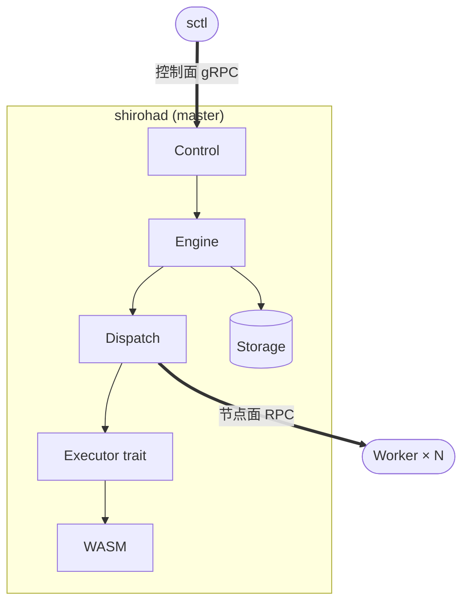

# 顶层架构

## 项目使命

为状态机驱动的工作流提供可扩展的编排能力。用户使用 WebAssembly 组件描述状态机及其 Action/Callback;引擎按用户声明的分发策略将重运算分派到本地或远端节点执行,并按用户选择的聚合策略合并结果,作为状态转移的输入。

## 角色分工

| 角色 | 形态 | 是否有状态 | 职责 |
| --- | --- | --- | --- |
| 主控 Master | `shirohad` master 模式 | 是 | 持有 FSM 实例状态、调度转移、聚合结果、暴露控制面 |
| 节点 Worker | `shirohad` worker 模式 | 否 | 接收主控派发的 Action,在 WASM 中执行后回报结果 |
| 控制端 CLI | `sctl` | 否 | 通过控制面对主控发送命令与查询 |
| FSM 模块 | wasm32-wasip2 component | — | 用户提供;声明状态、转移规则、Action 实现、分发/聚合策略 |

主控可同时以 worker 模式运行,把本机注册进 NodeRegistry 作为分发目标之一;装配层决定本地路径走 LocalExecutor 而非网络(见 `dispatch.md` 与 `worker.md`)。

## 设计原则

1. **KISS** — 每个 crate 体量小、职责单一,可独立阅读
2. **状态集中** — 仅主控持有运行时状态,worker 是纯函数式执行器
3. **职责正交** — 状态机模型 / WASM 运行时 / 分发策略 / 传输协议 / 持久化彼此通过 trait 解耦
4. **可替换基础设施** — gRPC / QUIC / 消息队列、redb / 其他后端在 trait 后切换,不动上层
5. **同一二进制承担多角色** — 部署与运维负担最小化

## 通信平面

Shiroha 内部存在两个独立的 RPC 平面,**不复用同一组 proto**:

- **控制面**:`sctl` ↔ `shirohad`,语义是「管理这台主控」(上传 flow、创建 job、查询状态)
- **节点面**:`shirohad master` ↔ `shirohad worker`,语义是「执行一次 Action」

两者可以共用底层 gRPC 基础设施,但服务定义、版本节奏、鉴权策略均独立演化。

## 模块拓扑

## 不变量

- 主控是状态的唯一权威源
- 节点不允许向其他节点直接通信;所有协作经过主控
- 任何状态变更与对应事件必须在单事务内落盘,见 `storage.md`
- WASM 主机能力是受控集合,不允许在 trait 外私设旁路

## 跨切面契约

以下关注点横跨多个 crate,在此统一定义。各子模块文档引用本节而非重复描述。

### Action 幂等性

**所有 Action 实现强烈建议幂等** — 相同输入多次执行的结果应与单次执行一致。

原因:Blocking 模式下主控重启会将已派发但未持久化结果的 Action 一律视为失败并走重试路径(详见 `engine.md`);此外,网络重试、Aggregator 超时后的重派发等场景同样可能导致 Action 被重复执行,无论 WaitingMode 如何。

**不能保证幂等的 Action**(如发送邮件、扣款)**必须**使用 `WaitingMode = Waiting`,确保结果在主控重启前已持久化,减少重复执行概率。但这不能完全消除网络层重复——用户应在业务层面尽可能实现幂等。

### 优雅关闭

主控收到 SIGTERM 后执行有序关闭:

1. 停止接收新 Job — Control 拒绝 `create-job`,返回"主控正在关闭"
2. 停止触发新的状态转移 — 已有驱动循环继续执行当前转移,但不启动新转移
3. 等待在途 Action 完成 — 所有已派发的 Action 等待结果回流;超时(可配置,默认 30s)后强制视为失败
4. 持久化最终状态 — 所有 Job 的当前状态与事件在事务内落盘
5. 关闭 Transport 连接 — 向所有节点发送断开通知
6. 退出

关闭过程中任意一步失败,记录错误日志但继续执行后续步骤——宁可留下可恢复的不一致状态,也不卡在关闭流程中。

### 背压与并发控制

- **Worker** — 必须配置并发执行上限(信号量);达到上限时返回 `RESOURCE_EXHAUSTED`,由 Dispatcher 选择其他节点或排队(详见 `worker.md`)
- **Dispatcher** — 不应无限制地向同一节点派发;节点返回资源不足时应退避(详见 `dispatch.md`)

### WASM 沙箱安全

主机对每个 WASM 实例施加以下限制,防止恶意或有 bug 的组件 DoS 主机进程:

| 限制项 | 默认值 | 说明 |
| --- | --- | --- |
| Fuel 计量 | 可配置 | 每次 Action 调用分配固定 fuel,耗尽后 trap |
| 内存上限 | 512 MB | 每个组件实例的线性内存上限 |
| 栈深度 | 128 层 | 防止无限递归 |
| 网络超时 | 30s | `net.http` 单次请求超时 |

具体值在 `shiroha-config` 中可配置,详见 `worker.md`。

### 网络安全

- **`net.http` SSRF 防护** — 主机必须配置目标地址的默认黑名单,阻止对内网地址段(`10.0.0.0/8`、`172.16.0.0/12`、`192.168.0.0/16`、`127.0.0.0/8`)、云 metadata 端点(`169.254.169.254`)等敏感目标的请求。具体规则在 `shiroha-config` 中管理(详见 `wit-interfaces.md`)
- **控制面鉴权** — 本地 UDS 受文件系统权限保护,可选 peer credential 检查;远程 TCP 需 mTLS(详见 `control-plane.md`)
- **能力声明校验** — 主控加载 WASM 组件时,校验其 import 与 Flow 能力声明的一致性;声明之外的 import 导致拒绝上传(详见 `engine.md`)

## 已知限制与未来方向

- **主控单点故障** — 当前设计仅支持单主控实例;主控所在机器宕机且无法恢复时,Job 状态丢失。v1.0 后考虑的 HA 方向包括:leader-election + 共享存储(如 etcd / Raft),或主控状态实时复制到 standby 节点。Store trait 的抽象层保证未来可替换后端而不动上层
- **跨版本 Job 迁移** — 当前不支持;建议取消旧 Job 用新版本重建。跨版本状态映射列入后续版本路标
