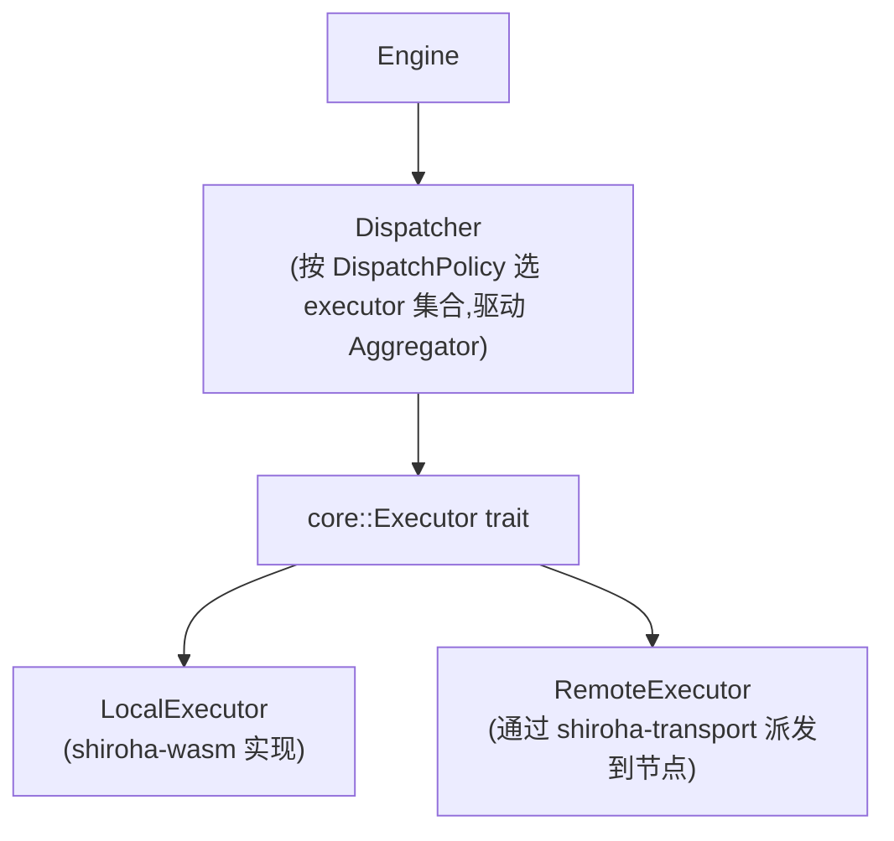

# Action 分发与聚合 (shiroha-dispatch)

## 角色

`shiroha-dispatch` 是 Engine 与"具体执行点"之间的中间层。它接收一个 ActionRef + ComponentId + 输入,根据 core 中声明的 DispatchPolicy 选择执行者集合,执行并收集结果,然后用 Aggregator 合并,把单一结果交还给 Engine。

Engine 不知道 Action 是本地还是远程执行,也不知道有几个 Worker 参与——这两件事都被 dispatch 层吸收。Dispatcher 也不关心 ComponentId 背后是哪个 Flow 版本,它只把 ComponentId 透传给 Executor。

## 抽象层次

`LocalExecutor` 与 `RemoteExecutor` 实现 `shiroha-core` 定义的 `Executor` trait,dispatch 层通过 trait 多态调度,不直接依赖 `shiroha-wasm`。

装配时,Dispatcher 持有 LocalExecutor 引用与 Transport trait 对象。当 selector 选出的节点包含主控自身时,Dispatcher 对该节点走 LocalExecutor 而非 RemoteExecutor,避免自环 RPC——这一判断基于装配层注入的"本机节点标识",Dispatcher 自身不区分"哪个是本地"。

## DispatchPolicy → Executor 映射

| Policy | Executor 集合 | Aggregator |
| --- | --- | --- |
| Local | 单个 LocalExecutor | 不调用 |
| Remote(selector, agg) | selector 返回的每个节点一个 RemoteExecutor | selector 返回 N>1 时调用,N=1 时忽略 |

主控自身可被 selector 选中,从而把"本地路径"作为 `Remote` 的成员之一;此时由 LocalExecutor 承担,避免一次自环 RPC。

## Aggregator 接入点

Aggregator 是同步语义的"收集器":接收若干结果,可能在收够最低数量时提前返回(如 First / Quorum)。Dispatcher 必须把"提前返回"和"剩余执行如何处置"一并定义。

**剩余执行的处置策略:取消 + 后台兜底**。Dispatcher 在 Aggregator 提前返回后,立即沿 transport 向剩余 executor 下发取消信号(best-effort);若取消未及时生效、结果仍然到达,Dispatcher 仅写日志,不影响主路径,不抛错。

这条策略由 Dispatcher 强制执行;Aggregator 自身只负责"何时算够",不参与剩余处置。

## Dead Letter

Aggregator 提前返回后,晚到的结果以及节点离线期间丢失的结果,除写入 tracing 日志外,还应持久化到 Storage 的 **dead-letter 表**中。每条记录包含:

- `(ComponentId, ActionRef, NodeId, 到达/丢失时间, 结果摘要或错误信息)`

`sctl` 提供 `list-dead-letters [--job-id] [--since]` 命令供排查。dead-letter 记录与 Event 共享 TTL 策略(默认 30 天清理)。

## 自定义聚合

当 ActionRef 声明 `Aggregation::Custom` 时,Dispatcher 收齐结果后回调 WASM 的 aggregate export(见 `wit-interfaces.md`)。自定义聚合不能阻塞 Dispatcher。

所有 Aggregation 类型共享 ActionRef 上的 `aggregation_timeout` 字段作为超时上限:Custom 超时后视为聚合失败;First / Quorum 超时后同样视为失败,走 ActionRef 的失败处理路径。未声明时使用全局默认值(由 `shiroha-config` 提供)。

## 失败传播

- Executor 内部任何失败统一上抛为 `ExecutionError`,区分网络型与业务型
- Aggregator 决定 ExecutionError 是否构成整体失败(如 AllOk 中任一失败即整体失败)
- Dispatcher 把最终的整体结果或失败交回 Engine;Engine 根据 ActionRef 元数据决定下一步(转入失败状态 / 触发补偿 / 重试)

补偿与重试策略由用户在 FSM 定义中声明,Engine 调度;Dispatcher 不内置任何业务重试。

## 与其他 crate 的契约

- 入参:`shiroha-core` 的 ActionRef + ComponentId + 输入字节
- 出参:聚合后的结果字节 或执行错误
- 依赖:`shiroha-core` 的 Executor trait(不直接依赖 `shiroha-wasm`)
- RemoteExecutor 由 dispatch 层自行组装:内部持有 `shiroha-transport` 的 Transport trait 对象,将 submit-action / cancel-action 映射为 Executor trait 的调用

## 不在本 crate 内的内容

- 实际网络协议(在 transport)
- WASM 执行细节(在 wasm)
- 状态持久化(在 storage)
- Job 生命周期(在 engine)

Dispatcher 只回答一个问题:"给我一个 Action + 输入,你给我聚合好的结果"。
