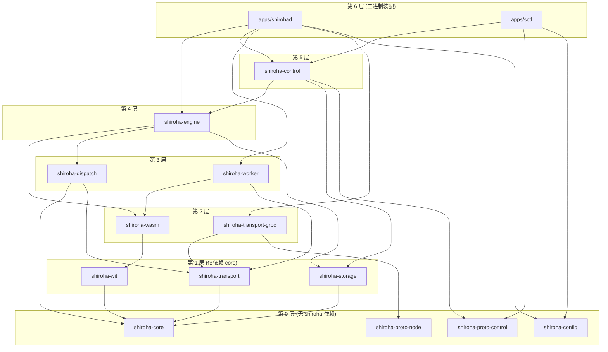

# Workspace 布局

## 目标

- 通过 crate 边界强制实现「职责正交」
- 单向依赖,无环;新增传输或存储后端只需新增 crate,不动现有 crate
- 二进制 (`apps/`) 只做装配,不写业务逻辑

## Crate 列表

`crates/` 下放置库 crate。每个 crate 至多承担一个职责。

| Crate | 职责 | 允许的依赖方向 |
| --- | --- | --- |
| `shiroha-core` | FSM/Action(含 WaitingMode)/ComponentId/Job/分发策略/聚合策略的纯 domain 类型与 trait;**Executor trait**;零 I/O。**Flow 不在 core**,见 storage.md | 仅标准库 + 序列化 |
| `shiroha-wit` | `.wit` 接口文件与 wit-bindgen 生成绑定 | core |
| `shiroha-wasm` | Wasmtime 集成、组件加载、Host 能力实现、Action 调用桥;实现 core 的 Executor trait | core, wit |
| `shiroha-dispatch` | Dispatcher + Aggregator;基于 core 的 Executor trait 做位置选择与聚合 | core, transport |
| `shiroha-transport` | 节点间 RPC 抽象 trait | core |
| `shiroha-transport-grpc` | tonic 实现的节点面 transport | transport, proto-node |
| `shiroha-proto-node` | 节点面 proto 的 tonic 生成代码;独立 build.rs | — |
| `shiroha-proto-control` | 控制面 proto 的 tonic 生成代码;独立 build.rs | — |
| `shiroha-storage` | Store trait + redb 默认实现;提供 `QueryStore` 只读子 trait;**Flow 版本管理与 Component 去重存储是主控层独有职责** | core |
| `shiroha-engine` | 主控:Job 调度、状态驱动、事件日志 | core, wasm, dispatch, storage |
| `shiroha-worker` | 节点:接收 Action,调用本地 Executor,回报结果 | core, wasm, transport |
| `shiroha-control` | 控制面 gRPC 服务定义与实现;只通过 `QueryStore` 访问存储(只读) | core, engine, proto-control |
| `shiroha-config` | 统一配置加载 | — |

`apps/` 下放置二进制:

| App | 角色 |
| --- | --- |
| `shirohad` | 装配 engine + worker + control + transport,按配置选择运行模式 |
| `sctl` | 装配控制面客户端 + clap CLI |

## 依赖方向规则

依赖箭头 `X --> Y` 表示 X 依赖 Y。按层组织(同层 crate 互不依赖);为减少视觉噪音,图中只画**直接**依赖,传递依赖通过路径体现。

硬性约束:

- `core` 不依赖任何其它 shiroha crate
- `wasm` 不依赖 `transport`,反之亦然
- `transport` 不依赖 `storage`,反之亦然
- `dispatch` 不依赖 `wasm`(通过 core 的 Executor trait 解耦)
- `engine` 是装配点,可以同时依赖多个底层 crate
- `control` 通过 `QueryStore` 只读访问 storage,所有写入必须经过 engine
- `apps/` 只做装配:把 trait 实现注入到对应抽象点
- 不允许出现下游 crate 反向引用上游 crate

任何打破上述方向的依赖应当先在 PR 中讨论。

## 关键 trait 归属

| Trait | 定义在 | 实现者 | 说明 |
| --- | --- | --- | --- |
| `Executor` | `shiroha-core` | `shiroha-wasm`(LocalExecutor) | dispatch 依赖此 trait;RemoteExecutor 由 dispatch 层自行组装(持有 Transport) |
| `Store` | `shiroha-storage` | redb 实现 | 完整读写接口 |
| `QueryStore` | `shiroha-storage` | 从 Store 派生 | 只读子集,供 control 使用 |
| `Transport` | `shiroha-transport` | `shiroha-transport-grpc` | 节点面 RPC 抽象 |

## proto 拆分

节点面与控制面的 proto 分属不同 crate(`shiroha-proto-node` / `shiroha-proto-control`),理由:

- 两者的版本节奏、鉴权策略独立演化
- `sctl` 只需控制面 proto,`shiroha-transport-grpc` 只需节点面 proto
- 避免一边变更触发另一边重编译
- 共享的 message 类型(如 ComponentId)放在 `shiroha-core` 中

## 命名约定

- crate 名一律以 `shiroha-<area>` 为前缀
- 后端实现使用 `shiroha-<area>-<backend>` 形式 (例:`shiroha-transport-grpc`、未来的 `shiroha-transport-quic`)
- proto crate 使用 `shiroha-proto-<plane>` 形式 (例:`shiroha-proto-node`、`shiroha-proto-control`)
- 二进制名沿用项目惯例:控制端 `sctl`,守护进程 `shirohad`
- 测试辅助 crate 后缀 `-testkit`,只用于 `[dev-dependencies]`

## 演化策略

- 新增传输协议:增加 `shiroha-transport-<name>`,实现 transport trait,主二进制按 feature 启用
- 新增存储后端:增加 `shiroha-storage-<name>` 或在 `shiroha-storage` 内通过 feature 切换
- 新增控制面客户端 (TUI/Web):新建二进制 crate,复用 `shiroha-proto-control` 的客户端 stub
- 拆分 crate 而不是塞功能:任何超过 ~1000 LOC 的 crate 应考虑是否还能再切
- **`shiroha-wasm` 拆分时机** — 当 Host 能力实现超过 6 个时,考虑拆出 `shiroha-host-capabilities`;当前(log + clock)不需要
- **`shiroha-common`** — 当跨 crate 共享基础类型(NodeId、公共错误枚举等)的需求出现第二个使用点时再提,不提前创建
