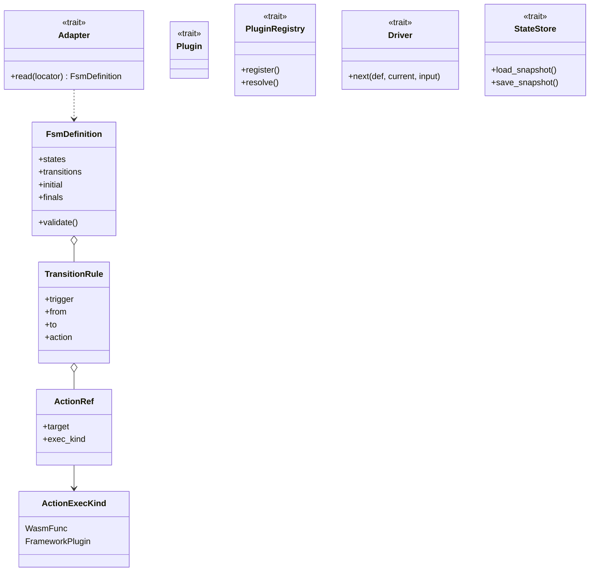

# feat: shiroha-core — 状态机模型与 trait 抽象层

## 上游对应

本 plan 实现 brainstorm(see origin: docs/brainstorms/2026-06-24-shiroha-framework-requirements.md)的第一层核心 + 跨预留接口:
- R1(状态机模型)、R2(adapter 抽象)、R4(action 执行类型声明)、R5(插件注册/发现契约)、R6(驱动在主控本地执行)的契约侧
- R17(持久化 trait 抽象)engine 侧预留

`shiroha-core` 是全 workspace 的根依赖,只含 trait 与类型,无运行时 IO。后续 `shiroha-wasm` / `shiroha-engine` / `shiroha-controller` 均引用本 crate 的抽象。

## 需求对应

- R1 → 统一状态机模型:状态、转移规则、action/callback 引用,独立于 adapter 与执行类型
- R2 → `Adapter` trait:从来源读出状态机结构;MVP 由 `shiroha-wasm` 实现
- R4 → `ActionExecKind` 枚举(声明每个 callback 的执行类型),MVP 仅 `WasmFunc`,框架插件作为预留变体
- R5 → `Plugin`/`PluginRegistry` trait 契约,运行期注册/发现,WASM 插件由 `shiroha-wasm` 承载,本 plan 只定 trait
- R6 → `Driver` trait:给定状态 + 输入决定下一状态,实现在主控本地(`shiroha-engine`),本 plan 留 trait
- R17 → `StateStore` trait:状态机实例/Job 状态持久化抽象,内存实现由 `shiroha-engine`,数据库后端 deferred

## Key Technical Decisions

**K1. Edition 2024 + `resolver = 3`。** workspace 已锁,沿用(see workspace `Cargo.toml`)。

**K2. 零运行时依赖。** `shiroha-core` 只引 `serde`、`thiserror`、`async-trait`(均在 workspace deps)。不引 wasmtime、tokio,保证下游可选层不被传染。`async-trait` 用于 IO 相关的 trait(`Adapter`、`StateStore`);`Driver` 同步纯函数,不加 async。

**K3. adapter 与执行类型正交。** `Adapter` trait 只解状态机**结构**;`ActionExecKind` 是 callback 上的独立枚举维度。brainstorm key decision 原文要求两者不混为一谈。

**K4. crate 命名沿用前版 `shiroha-core`。** git 历史中前版已用过此划分,维持可借鉴性。

**K5. WIT / proto 细节不在本 plan。** WIT 形状、gRPC proto 留给对应实现 plan(`shiroha-wasm` / `shiroha-controller`);本 plan 只定 Rust 侧结构。

## 范围边界

### Deferred to Follow-Up Work

- 文本 adapter(TOML/YAML/JSON)实现 —— R2 接口已留,`shiroha-engine` 或单独 crate 后续实现
- 插件官方实现(http 等)—— R5 契约已留,初期不提供
- `StateStore` 的具体数据库后端 —— R17 trait 已留,内存实现在 `shiroha-engine`

### Outside this product's identity

- 不在本 plan 内定义业务重试/补偿 —— 由用户在 FSM 定义中声明

## Implementation Units

### U1. 状态机模型核心类型

**Goal:** 定义 FSM 的数据模型:状态、转移规则、action/callback 引用,与 adapter/执行类型解耦。

**Requirements:** R1

**Dependencies:** 无

**Files:** `shiroha-core/src/model.rs`(create)、`shiroha-core/src/lib.rs`(create)

**Approach:**
- `State`(newtype 包 `Arc<str>` 或 enum?见下方 deferred):状态标识
- `TransitionRule`:转移规则,持有 from-state、to-state、关联的 action/callback 引用
- `ActionRef`:callback 引用,绑定一个 `ActionExecKind`
- `FsmDefinition`:状态集合 + 转移规则集合 + 入口/终态
- 全部 `serde::{Serialize, Deserialize}`,以 `thiserror::Error` 定义 `CoreError`

**Technical design (directional):**

```
FsmDefinition { states: Set<State>, transitions: Vec<TransitionRule>, initial: State, finals: Set<State> }
TransitionRule { trigger: Input, from: State, to: State, action: Option<ActionRef> }
ActionRef { target: CallbackId, exec_kind: ActionExecKind }
```

**Patterns to follow:** workspace 已用 `thiserror 2.0`;错误类型用 `#[error("...")]` derive 惯例。

**Test scenarios:**
- Happy:构造一个两状态、一条转移的 `FsmDefinition`,序列化→反序列化后字段相等
- Edge:`initial` 不在 `states` 集合内 → `FsmDefinition::validate` 返回 `CoreError::InvalidInitialState`
- Edge:`finals` 含不在 `states` 内的状态 → 返回 `CoreError::UnknownFinalState`
- Edge:转移的 `from`/`to` 不在 `states` → 返回 `CoreError::UnknownState`
- Edge:两条同 `trigger`+`from` 的转移(非确定性)→ 返回 `CoreError::AmbiguousTransition`

**Verification:** `cargo test -p shiroha-core` 通过;`FsmDefinition::validate` 对合法定义返回 `Ok(())`。

### U2. adapter 抽象与执行类型维度

**Goal:** 定义 `Adapter` trait(读状态机结构)与 `ActionExecKind` 枚举(执行类型正交维度)。

**Requirements:** R2、R4

**Dependencies:** U1

**Files:** `shiroha-core/src/adapter.rs`(create)

**Approach:**
- `Adapter` trait:async fn,输入来源描述(WASM 组件句柄 / 文本路径),输出 `FsmDefinition`
- `ActionExecKind`:枚举 `WasmFunc`(MVP)/ `FrameworkPlugin`(预留,持有 `PluginId`)
- 不在 trait 上绑 wasmtime 类型 —— 来源句柄用本 crate 的 `ComponentLocator` newtype(adapter 实现侧再转具体运行时类型)

**Test scenarios:**
- Happy:定义一个仅 `WasmFunc` 变体的 mock adapter,喂入 stub locator,返回合法 `FsmDefinition`
- Edge:adapter 解析返回非法定义 → 调用方拿到 `CoreError::InvalidDefinition`
- Error:源不可读 → adapter 实现返回 `AdapterError::SourceUnreachable`(error trait 公开)

**Verification:** mock adapter 单测覆盖 `Adapter` 契约;`ActionExecKind` 枚举覆盖两种变体(含预留变体可构造、可序列化占位)。

### U3. 插件注册/发现契约

**Goal:** 留 `Plugin`/`PluginRegistry` trait,初期不提供官方插件,只定注册/发现接口。

**Requirements:** R5

**Dependencies:** U1

**Files:** `shiroha-core/src/plugin.rs`(create)

**Approach:**
- `Plugin`:实现该 trait 的对象承载一个能力命名空间(`http`、`db` 等),供文本 adapter 引用
- `PluginRegistry`:运行期 `register(plugin)` / `resolve(capability) -> Plugin`(async)
- MVP 不实例化任何插件 —— `shiroha-wasm` 后续把 WasmComponent-plugin 装进 trait;文本 adapter 后续引用 `PluginRegistry::resolve`
- 不做编译期 feature 分流,brainstorm key decision 倾向运行期

**Test scenarios:**
- Happy:写 in-memory `PluginRegistry` 测试桩,注册一个 stub plugin,resolve 命中返回它
- Edge:resolve 未注册能力 → 返回 `PluginError::NotFound`
- Edge:重复注册同名能力 → 返回 `PluginError::AlreadyRegistered`
- Integration:registry 持 `Arc<dyn PluginRegistry>` 跨 await 点共享 —— 用 tokio 测试 runtime 验证可被多 task 并发 resolve

**Verification:** `cargo test -p shiroha-core` 含 plugin 模块用例;`PluginRegistry` 实现者只需满足 trait 即可接入。

### U4. 驱动与持久化 trait 预留

**Goal:** 留 `Driver` trait(决策下一状态)与 `StateStore` trait(状态持久化抽象)。实现在 `shiroha-engine`,本 plan 只定契约。

**Requirements:** R6、R17

**Dependencies:** U1

**Files:** `shiroha-core/src/driver.rs`(create)、`shiroha-core/src/store.rs`(create)

**Approach:**
- `Driver` 同步纯函数:`fn next(def, current, input) -> Result<Transition, DriveError>` —— 不带 async(无 IO)
- `StateStore`:async trait,`load_snapshot`/`save_snapshot`/`record_transition`,内存实现由 `shiroha-engine`,DB 后端 deferred
- `Driver` 不持有状态(`shiroha-engine` 在主控本地调用,契合 R6)

**Test scenarios:**
- Happy:对两状态一转移的 `FsmDefinition`,stub `Driver` 实现对合法 input 返回 `to-state`
- Edge:input 不匹配任何转移 → `DriveError::NoTransition`
- Edge:当前状态不在 `def.states` → `DriveError::UnknownCurrentState`
- Integration:`StateStore` async trait 在 tokio runtime 下可 spawn task 调用 `save_snapshot` 不 panic

**Verification:** trait 实现可通过单测桩验证;无具体运行时依赖被引入本 crate。

## High-Level Technical Design



## Assumptions

- crate 划分沿用前版命名 `shiroha-core`(git 历史可借鉴,非强制)
- `State` 用 `Arc<str>` 而非 enum —— 字段级细节 deferred(脑暴 Deferred to Planning Q5),MVP 先按字符串标识,后续可换强类型

## Open Questions

- 状态机模型字段级细节(状态/转移/action 引用的具体结构)—— MVP 用最小可用结构,实现期可调整,brainstorm 已列为 Deferred to Planning
- adapter 与插件注册机制形态(编译期 feature vs 运行期配置)—— 倾向运行期,brainstorm key decision 已表态,留待 `shiroha-engine` 期定形

## Sources & Research

- 无外部研究:全新空 workspace,既有代码为零;脑暴文档 + workspace `Cargo.toml` 为唯一直接依据