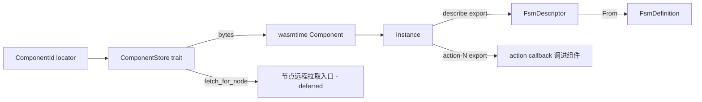

# feat: shiroha-wasm — WASM Component adapter 与字节存储

## 上游对应

本 plan 实现脑暴第一层的 WASM 侧与第二层的字节权威部分(see origin: docs/brainstorms/2026-06-24-shiroha-framework-requirements.md):
- R3 → WASM Component adapter:运行时从组件内读取状态机结构描述符(不在 WASM 内跑状态机本身)
- R4 MVP 执行类型 `WasmFunc` 的承载点
- R5 WASM 插件 → 用 `shiroha-core` 的 `Plugin` trait 实现(本 plan 落 WASM 侧)
- R8(部分)→ 节点按需从主控拉 WASM 组件字节,主控为字节权威源:留拉取入口,**节点本身不实现**(MVP 单机)
- R11 → 组件存储初期框架内置,后续可外接 registry;存储层通过 trait 抽象

依赖 `shiroha-core`(U1–U4 的 trait)。

## 需求对应

- R3:WASM adapter 读组件导出的描述符 → `FsmDefinition`
- R4:callback 执行类型 `WasmFunc` 经 wasmtime 调进组件内 func
- R5:WASM Component-plugin 装进 `shiroha-core::Plugin` trait
- R8 部分:暴露 `ComponentStore` 拉取入口(单机走本地路径,远程派发 deferred)
- R11:`ComponentStore` trait 初期内存实现,trait 抽象留外接 registry

## Key Technical Decisions

**K1. wasmtime 46 + WASI p3。** workspace 已锁(see workspace `Cargo.toml` `wasmtime 46.0` + `wasmtime-wasi p3`)。用 Component Model 加载组件。

**K2. 运行时解析描述符,非运行状态机本身。** R3 明确:状态机在外(Rust 侧 `Driver`),WASM 组件只导出"状态机结构描述符 + action 实现 func"。`shiroha-wasm` 负责把描述符读成 `FsmDefinition`,再把 `ActionRef` 映射到组件 func 调用。

**K3. WIT 接口形状本 plan 定。** brainstorm Deferred to Planning Q4 归此 plan。WIT 定义组件导出:`describe() -> FsmDescriptor` + 每个 action 一个 exported func。

**K4. `ComponentStore` 初期内存 map。** 主控启动时把组件字节加载进内存,节点拉取时直接返回(单机即本地内存查表)。外接 registry 通过 trait 替换,deferred。

**K5. 不引 tokio 全量。** `shiroha-wasm` 需要 async(主控调用走 tokio),引 workspace 的 `tokio` + `async-trait` + `wasmtime`/`wasmtime-wasi`。**不引 tonic**(gRPC 留给 controller)。

**K6. 错误统一 `WasmError`,包装 wasmtime 内部错误。** 用 `thiserror`,workspace 已锁。

## 范围边界

### Deferred to Follow-Up Work

- 远程 fetch 字节(R8 完整)—— 节点拉字节的网络协议面留给 `shiroha-engine` 远程派发实现;单机 MVP `ComponentStore` 走本地内存
- 组件 registry 外接(R11 后半)—— trait 已留,具体 registry 适配 deferred
- 文本 adapter 引用 WASM 插件(R5 文本侧联动)—— 文本 adapter 本身 deferred,联动随之 deferred

### Outside this product's identity

- 不在 WASM 内跑状态机决策 —— 决策在主控 `Driver`(R6),WASM 组件只是被驱动

## Implementation Units

### U1. WIT 接口与描述符类型

**Goal:** 定义 WASM 组件导出侧与 host 侧的 WIT 接口,以及 host 侧的 `FsmDescriptor` 中间类型(从组件读出再转 `FsmDefinition`)。

**Requirements:** R3、R4(R4 需要 func 命名约定)

**Dependencies:** shiroha-core U1、U4

**Files:** `shiroha-wasm/wit/shiroha.wit`(create)、`shiroha-wasm/src/descriptor.rs`(create)、`shiroha-wasm/src/lib.rs`(create)

**Approach:**
- WIT 定义:`describe() -> descriptor` 与 action exported func 命名约定(如 `action-<id>`)
- host 侧 `FsmDescriptor`:与 `FsmDefinition` 对应的中间结构,补 R3 不在组件内跑状态机的边界 —— 用 `From<FsmDescriptor> for FsmDefinition` 完成转换 + 校验
- func 命名约定文档化在 WIT 注释里(实现期定细节,见 Open Questions)

**Technical design (directional):**

```
package shiroha:component@0.1;

interface descriptor {
    variant descriptor {
        states: list<string>,
        initial: string,
        finals: list<string>,
        transitions: list<transition-rule>,
    }
    describe: func() -> descriptor;
}
// action func 按约定命名 action-<id>(input) -> output
```

**Test scenarios:**
- Happy:手工构造一合法 `FsmDescriptor`,转 `FsmDefinition` 成功且字段一一对应
- Edge:`descriptor.initial` 不在 `states` → `From` 转换 `Err` 返回 `CoreError::InvalidInitialState`
- Edge:transition `from`/`to` 跨出 states → 转 `Err`
- Integration:`#[cfg(test)]` 用 `wit-bindgen` 生成 host 绑定后,构造 mock 组件 should-compile(见 Verification,实际组件集成在 U3)

**Verification:** `cargo build -p shiroha-wasm --tests` 通过;WIT 语法经 `wit-bindgen` 生成期校验。

### U2. WASM Component adapter 实现

**Goal:** 实现 `shiroha-core::Adapter` trait:用 wasmtime 加载组件、调用 `describe`、转 `FsmDefinition`。

**Requirements:** R2(实现)、R3

**Dependencies:** U1、shiroha-core U2

**Files:** `shiroha-wasm/src/adapter.rs`(create)

**Approach:**
- `WasmComponentAdapter` 持 `wasmtime::Engine` + `ComponentStore` 句柄
- `Adapter::read(locator)`:从 locator 取字节 → wasmtime `Component::from_slice` → 实例化 → 调 `describe` → 转换校验 → `FsmDefinition`
- 单机 MVP:节点不实现(R8),adapter 也在主控侧跑;`ComponentStore` 给 adapter 提供字节本地查表

**Patterns to follow:** wasmtime 46 Component Model 加载惯用(`Engine`→`Component`→`Linker`→`Instance`→导出函数调用)。

**Test scenarios:**
- Happy:用 `wat2wasm` 生成最小合法组件(单 export `describe` 返回固定 descriptor),adapter `read` 成功
- Edge:组件缺 `describe` export → `WasmError::MissingDescriptor`
- Error:组件字节损坏 → `Component::from_slice` 报错包装为 `WasmError::InvalidComponent`
- Error:组件 `describe` panic/trap → `WasmError::DescriptorTrap`
- Integration:adapter 与 `shiroha-engine` 的 `Driver` 对接(返回的 `FsmDefinition` 喂 Driver 合法,见 shiroha-engine plan U)—— 本 plan 用 mock driver 桩校验接口形状

**Verification:** `cargo test -p shiroha-wasm` 含真实最小组件加载用例(`wasm-tools` 或 `wat2wasm` prov. 见 Open Questions for tooling assumption)。

### U3. ComponentStore 与节点拉取入口

**Goal:** 实现 `ComponentStore` trait(R11)+ 内存默认实现,并暴露"按需拉取"入口(R8 部分,单机为本地查表)。

**Requirements:** R8(部分)、R11

**Dependencies:** shiroha-core U4(`StateStore` 同期抽象风格参考)、U1

**Files:** `shiroha-wasm/src/store.rs`(create)

**Approach:**
- `ComponentStore` trait:async `get(id) -> Bytes`、`put(id, bytes)`、`contains(id)`
- `InMemComponentStore`:锁 `RwLock<HashMap<ComponentId, Bytes>>`,组件在主控启动时加载
- 节点拉取入口:`fetch_for_node(id) -> Bytes` —— MVP 单机走 `InMemComponentStore::get`(本地内存指针),远程协议面留给 `shiroha-engine` 远程派发实现
- `ComponentId`:newtype 包 `Arc<str>`(与 `ActionRef` 引用对齐)

**Test scenarios:**
- Happy:put 两个 id,contains 与 get 命中
- Edge:get 不存在 id → `StoreError::NotFound`
- Edge:重复 put 同 id 覆盖(策略:MVP 覆盖,记录 Open Questions 是否拒绝覆盖)
- Integration:多 task 并发 `get` 不 panic(`RwLock` 读并发);单 task `put` 期间 `get` 等待(`RwLock` 写排他)
- Integration:`WasmComponentAdapter` 从 `ComponentStore::get` 取字节 → 加载成组件 → 校验链通

**Verification:** `cargo test -p shiroha-wasm` store 模块并发用例通过;`fetch_for_node` 在单机路径返回与 `get` 一致的字节。

### U4. WASM Plugin 装入 Plugin trait

**Goal:** 实现一个把 WASM 组件能力装进 `shiroha-core::Plugin` 的适配,作为 R5 的 WASM 侧承载(不提供官方插件,只验证注册/发现链路)。

**Requirements:** R5

**Dependencies:** shiroha-core U3、U2

**Files:** `shiroha-wasm/src/plugin.rs`(create)

**Approach:**
- `WasmPlugin`:实现 `Plugin`,内嵌一个组件的某能力命名空间,注册到 `PluginRegistry` 后被文本 adapter 引用
- MVP 不发官方插件 —— 本 plan 只证明"WASM-side plugin 能接入 trait",配合 `shiroha-core` 的 registry 测试桩验证
- 文本 adapter 引用能力侧 deferred,故本 plan 不验证端到端文本引用,只验证注册/发现的 WASM-side 桥接

**Test scenarios:**
- Happy:构造 mock WASM 组件导出某能力,`WasmPlugin::from_component` 后 `register` 命中,`resolve(capability)` 返回它
- Edge:组件缺该能力 export → `WasmError::MissingPluginCapability`
- Integration:与 `shiroha-core::PluginRegistry` 的 in-memory registry 桩对接,WASM plugin 经 trait 对象可被 resolve

**Verification:** `cargo test -p shiroha-wasm` plugin 模块用例通过;不产生官方插件代码。

## High-Level Technical Design



## Assumptions

- WIT 字段级形状(`FsmDescriptor` 的 variant/record 选型)在 U1 实现期定;brainstorm Deferred to Planning Q4 归此 plan,本 plan 给方向不锁死字段
- 组件加载用 `wasm-tools`/`wat2wasm` 造测试组件(见 Open Questions for test tooling availability in Nix shell)

## Open Questions

- WIT 接口字段级细节(states/initial/finals/transition 的具体 record 形状)—— U1 实现期定
- 测试组件如何生成:Nix flake 是否已提供 `wasm-tools`/`wit-bindgen` —— 影响测试构建链,实现期核查 `flake.nix`/`flake.lock`
- `ComponentStore::put` 重复 id 覆盖策略 —— MVP 倾向覆盖,是否拒绝重叠 id 留实现期
- 节点拉取入口在单机 MVP 是否完全 no-op(只走本地内存)还是留薄 HTTP/gRPC 占位 —— 倾向 no-op,远程协议一并留给 `shiroha-engine`

## Sources & Research

- 无外部研究:全新 workspace,无既有 WASM 代码;workspace `Cargo.toml` 锁定的 wasmtime 46 / WASI p3 为依据
- 内部依据:脑暴 R3/R4/R5/R8/R11 + key decisions(WASM 插件开放扩展点、运行时不跑状态机本身)