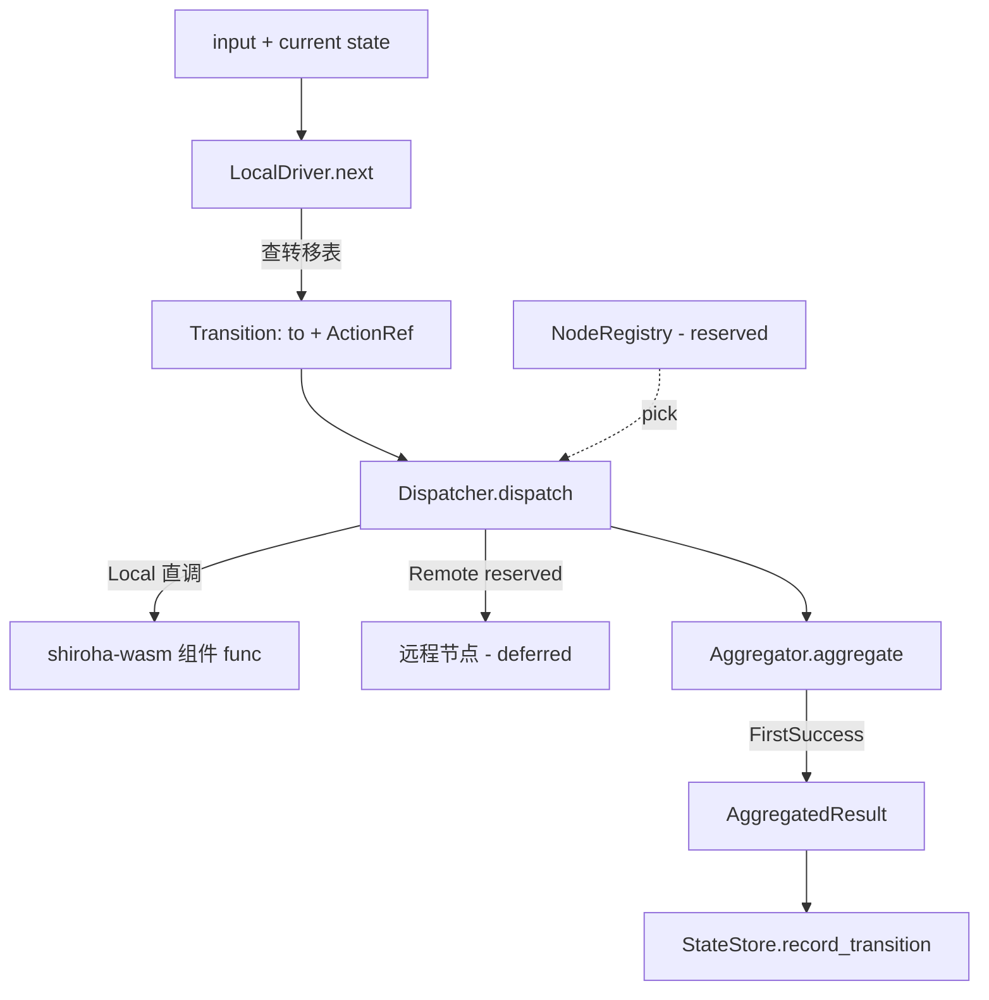

# feat: shiroha-engine — 本地执行路径与分发器/聚合抽象层

## 上游对应

本 plan 实现脑暴第一层的驱动实现 + 第二层分发器抽象 + 跨层持久化内存实现(see origin: docs/brainstorms/2026-06-24-shiroha-framework-requirements.md):
- R6 → `Driver` 实现:在主控本地执行,内嵌 wasmtime 调组件 action
- R7 → 分发器是 Engine 与执行点之间的中间层,接口预留,MVP 单机走本地执行路径
- R8 → 节点为无业务状态执行器,内嵌 wasmtime,按需从主控拉 WASM 组件字节(MVP 单机无节点;engine 走本地直接调组件)
- R9 → 主控内置节点注册表(注册 + 心跳 + 健康标记),分发时据此选节点 —— 接口预留
- R10 → 最小默认聚合(首个成功结果),复杂聚合走插件 —— 接口预留
- R11 → 组件存储初期框架内置(storage trait 在 `shiroha-wasm`,engine 消费)
- R17 → MVP 内存运行,不落盘;`StateStore` 内存实现

依赖 `shiroha-core`(trait)与 `shiroha-wasm`(adapter / store / action 调进组件)。

## 需求对应

- R6:`Driver` 实现 + 调 WASM action via `shiroha-wasm` 加载的组件 func
- R7:`Dispatcher` trait + `LocalDispatcher`(MVP)实现,远程派发的 `RemoteDispatcher` 接口预留
- R8:单机路径下"零节点",本地直接执行;节点接口预留(节点 runner 由 `shiroha-controller` 远程派发期实现)
- R9:`NodeRegistry` trait 预留,内存实现可选
- R10:`Aggregator` trait + `FirstSuccess` 默认实现,复杂聚合走插件接口
- R17:`InMemStateStore` 实现 `shiroha-core::StateStore`

## Key Technical Decisions

**K1. 单机 MVP 无节点进程。** 主控内嵌 wasmtime,`LocalDispatcher` 直接调 `shiroha-wasm` 已加载的组件 action func;`NodeRegistry` trait 留空或内存桩。R8 节点 runner 模式 + 远程派发整体 deferred,接口落在 `shiroha-engine` 而非独立 crate。

**K2. `Dispatcher` 是 Engine 与执行点的中间层(R7 原文)。** trait 接受 `ActionRef + input`,返回结果流;`LocalDispatcher` 同进程直调,`RemoteDispatcher` 接口预留(后续桥 `shiroha-controller` 远程协议面)。

**K3. 聚合策略可插拔,默认 `FirstSuccess`(R10)。** `Aggregator` trait 收多节点结果,`FirstSuccess` 取首个成功;复杂聚合走 `Plugin`(shiroha-core U3),接口预留。

**K4. `StateStore` 内存实现用 `RwLock<HashMap>`。** R17 MVP 不落盘,DB 后端 deferred;trait 已在 shiroha-core U4。

**K5. 引 tokio + wasmtime(经 shiroha-wasm 重导出或直接引)。** engine 是异步运行层,async trait 实现侧需要 runtime。

**K6. 不引 tonic。** gRPC 是 controller 的事,engine 暴露纯 Rust API 给 controller 调。

## 范围边界

### Deferred to Follow-Up Work

- 远程节点 runner(`shirohad worker` 模式)—— R8 完整,接口预留
- `RemoteDispatcher` 实现 —— R7 远程侧,trait 预留
- 节点心跳/健康协议面 —— R9 接口预留,具体协议细节 deferred
- 复杂聚合插件实例 —— R10 trait + `FirstSuccess` MVP,复杂聚合走 `Plugin` 接口但官方实例 deferred
- 持久化后端 —— R17 `InMemStateStore` MVP,DB 后端 deferred
- 节点面与控制面的具体协议细节 —— brainstorm 已列 Deferred for later

### Outside this product's identity

- 不在 engine 内做业务重试/补偿 —— FSM 定义声明,引擎只调度(brainstorm 明确)
- 单主控 MVP,不做 HA / 多主控

## Implementation Units

### U1. Driver 实现与 WASM action 调用

**Goal:** 实现 `shiroha-core::Driver` 同步决策 + 把 `ActionRef`(`WasmFunc`)分发到 `shiroha-wasm` 加载的组件 func 执行。

**Requirements:** R6、R4(MVP `WasmFunc` 调进组件)

**Dependencies:** shiroha-core U1/U4、shiroha-wasm U2

**Files:** `shiroha-engine/src/driver.rs`(create)、`shiroha-engine/src/lib.rs`(create)

**Approach:**
- `LocalDriver`:实现 `Driver::next` —— 查 `FsmDefinition` 转移表得 `to-state` + 关联 `ActionRef`
- action 执行:engine 持 `shiroha-wasm` 的组件实例句柄,按 `ActionRef.target` 找导出 func,调进组件,取结果
- 单机 MVP:action 直接在主控进程内 wasmtime 里跑,无节点进程

**Patterns to follow:** `shiroha-core::Driver` trait 同步签名(see shiroha-core plan U4)。

**Test scenarios:**
- Happy:两状态一转移`、`ActionRef(WasmFunc,"action-go")),Driver 对 input `go` 返回到 B 态、action 调进 mock 组件返回预期 output
- Edge:input 无匹配转移 → `DriveError::NoTransition`(沿用 core 契约)
- Edge:`ActionRef` 指向组件不存在的 export → `EngineError::ActionNotFound`
- Error:组件 func trap → `EngineError::ActionTrap` 包装 wasmtime 错误
- Integration:driver + `InMemStateStore`(U4)协同 —— save snapshot 后 next 起点正确

**Verification:** `cargo test -p shiroha-engine` driver 模块用例通过;mock 组件由 `shiroha-wasm` 测试工具提供(见其 plan U2 Open Questions 的组件构建链)。

### U2. Dispatcher 抽象与本地执行路径

**Goal:** 定义 `Dispatcher` trait(R7),MVP 实现 `LocalDispatcher` —— engine 与执行点之间中间层;action 本地直调,无节点进程。

**Requirements:** R7、R8(MVP 单机本地执行)

**Dependencies:** U1

**Files:** `shiroha-engine/src/dispatch.rs`(create)

**Approach:**
- `Dispatcher` trait:async `dispatch(action_ref, input) -> DispatchResult`
- `LocalDispatcher`:引擎持 `shiroha-wasm` 组件实例 map,dispatch 直接内部调 action func
- `RemoteDispatcher` 接口预留(async `dispatch` 同签名,实现桥节点协议面)—— 本 plan 只留 trait 占位 + 注释指向 `shiroha-controller` 远程期实现
- `DispatchResult`:成功/失败/trap,带 action id 与输出

**Test scenarios:**
- Happy:`LocalDispatcher` dispatch 合法 action ref → 返回成功 + output
- Edge:dispatch 未加载的组件 action → `DispatchError::ComponentNotLoaded`
- Error:dispatch 执行 trap → `DispatchError::ExecutionTrap`
- Integration:`LocalDispatcher` 被 `LocalDriver` 调用链路打通(driver.next → dispatcher.dispatch → 组件 func)
- Interface:`RemoteDispatcher` trait 可被空实现体满足(证明 trait 形状可远程实现)

**Verification:** `cargo test -p shiroha-engine` dispatch 模块用例通过;`RemoteDispatcher` 编译期通过占位实现。

### U3. NodeRegistry 抽象预留

**Goal:** 留 `NodeRegistry` trait(R9)—— 注册/心跳/健康标记/选节点;MVP 单机无需真实节点,trait + 内存桩即可。

**Requirements:** R9

**Dependencies:** U1

**Files:** `shiroha-engine/src/node.rs`(create)

**Approach:**
- `NodeRegistry` trait:async `register(node) -> NodeId`、`heartbeat(node_id)`、`mark_unhealthy(node_id)`、`pick_for_dispatch() -> Option<NodeId>`
- `InMemNodeRegistry`:MVP 内存桩,无真实节点时 `pick_for_dispatch` 返回 `None`,`LocalDispatcher` 不查阅它
- 真实节点协议面(心跳 cadence、健康阈值)deferred

**Test scenarios:**
- Happy:注册两节点,heartbeat 更新 ts,`pick_for_dispatch` 返回健康节点之一
- Edge:节点 mark_unhealthy 后 `pick_for_dispatch` 跳过它
- Edge:heartbeat 超时窗口(桩时间)→ 节点视作不健康 — 用 mock clock 或 `tokio::time::pause`
- Edge:注册未知 id heartbeat → `NodeError::UnknownNode`
- Interface:`InMemNodeRegistry` 与 `LocalDispatcher` 解耦 —— `LocalDispatcher` 不持 registry 引用(单机路径用不上),trait 仅供 RemoteDispatcher 期使用

**Verification:** `cargo test -p shiroha-engine` node 模块用例通过;trait 形状经空实现体校验。

### U4. Aggregator 抽象与 FirstSuccess 默认

**Goal:** 留 `Aggregator` trait(R10)收多节点 dispatch 结果,默认 `FirstSuccess` 取首个成功;复杂聚合走 `Plugin`(shiroha-core U3)接口预留但官方实例 deferred。

**Requirements:** R10

**Dependencies:** U2

**Files:** `shiroha-engine/src/aggregate.rs`(create)

**Approach:**
- `Aggregator` trait:async `aggregate(stream_of_dispatch_results) -> AggregatedResult`
- `FirstSuccess`:返回首个成功结果,无成功则返回所有失败聚合
- MVP 单机只有一结果流,`FirstSuccess` 退化为直接返回;复杂聚合("多数成功"、"最快响应"等)走 `Plugin` trait,本 plan 不实例化
- `AggregatedResult`:成功 + output / 失败 + 原因集

**Test scenarios:**
- Happy:给 `FirstSuccess` 流喂 [Ok(o1), Err(e)],返回 Ok(o1)
- Happy:给 `FirstSuccess` 流喂 [Err(e1), Ok(o2)],返回 Ok(o2)
- Edge:纯 [Err, Err] 流 → `AggregatedResult::AllFailed`
- Edge:空流 → `AggregatedResult::Empty`
- Integration:`Plugin` 复杂聚合路径 trait 形状校验 —— 桩实现一个 `AggregatorPlugin::aggregate` 走 `PluginRegistry::resolve`,证明接得通(不发布官方插件)

**Verification:** `cargo test -p shiroha-engine` aggregate 模块用例通过;`FirstSuccess` 为 std 默认且可经配置/启动参数选择(预留,配置加载在 controller)。

### U5. InMemStateStore 实现

**Goal:** 实现 `shiroha-core::StateStore` 内存版(R17),MVP 不落盘;`RwLock<HashMap>` 守护状态机实例/Job 状态。

**Requirements:** R17

**Dependencies:** shiroha-core U4

**Files:** `shiroha-engine/src/store.rs`(create)

**Approach:**
- `InMemStateStore`:异步 trait 实现,`load_snapshot(job_id)` / `save_snapshot(job_id, state)` / `record_transition(job_id, transition)`
- 锁:读 `RwLock<HashMap<JobId, Snapshot>>`,写独占
- 主控重启丢状态(MVP 内存态可接受,DB 后端 deferred)

**Test scenarios:**
- Happy:save 一 snapshot,load 命中字段一致
- Edge:load 不存在 JobId → `StoreError::NotFound`
- Edge:save 两次同 JobId 后 load 拿后一次
- Integration:多 task 并发 save 不同 JobId 不互相覆盖;同 JobId 并发 save 序列化(无交错半态)
- Integration:与 U1 Driver + U2 Dispatcher 完整单机跑通一个两状态推进 —— driver.next 决策 → dispatcher.dispatch 执行 → store.record_transition 落内存快照

**Verification:** `cargo test -p shiroha-engine` store 模块 + 端到端用例通过;单机推进链路短跑能看见起始态→中间态→终态的快照序列。

## High-Level Technical Design

## Assumptions

- engine 不直接引 tonic(gRPC 留 controller)
- 节点 runner 远程化时,dispatcher 远程侧 + node registry 真实协议一并由 `shiroha-controller` 期实现,本 plan trait 形状须与之兼容
- `JobId` 与 `ActionRef` 类型沿用 shiroha-core / shiroha-wasm 命名,engine 不重建类型

## Open Questions

- 节点心跳 cadence / 健康判据 —— R9 接口预留,具体值 deferred
- 复杂聚合(多数、最快、加权)是否纳入 `Plugin` 文本 adapter 引用面 —— R10 已倾向走 `Plugin`,具体协议与 `shiroha-wasm::WasmPlugin` 联动 deferred
- `StateStore::record_transition` 是否落增量日志(为 DB 后端铺路)还是只存当前快照 —— MVP 只当前快照,增量 deferred 到后端期

## Sources & Research

- 无外部研究:全新 workspace;脑暴 R6/R7/R8/R9/R10/R11/R17 + key decisions(分布式可选、单机跑通、节点无业务状态、不背重试补偿、单主控)为依据