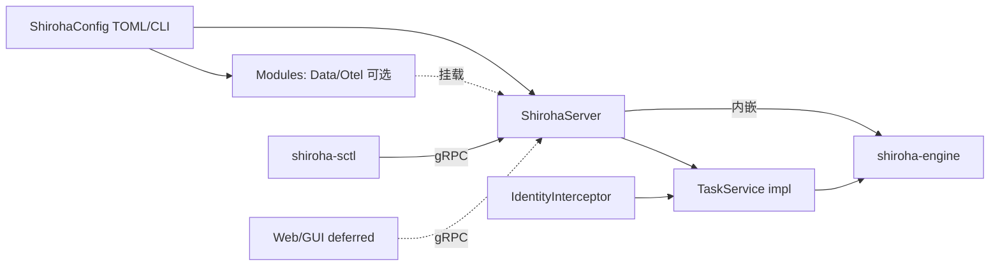

# feat: shiroha-controller — server 形态控制器与任务管理

## 上游对应

本 plan 实现脑暴第三层控制器 + 跨层身份/可选模块加载(see origin: docs/brainstorms/2026-06-24-shiroha-framework-requirements.md):
- R12 → 控制器是独立进程,server 形态,接受 GUI/CLI/Web 客户端连接(非可嵌入库)
- R13 → 任务管理:创建/查询/暂停/恢复/取消
- R14 → 最小身份接口:接受身份 + 操作请求做粗粒度放行;细粒度策略下放 Web 层
- R15 → 数据管理与 OpenTelemetry 为可选模块,运行期配置/启动参数加载
- R16 接口共用侧:controller 暴露 gRPC,CLI 与未来 Web/GUI 共用(brainstorm Deferred to Planning Q2 归此 plan:协议 vs 其他)

依赖 `shiroha-core`、`shiroha-wasm`、`shiroha-engine`。

## 需求对应

- R12:`shirohad` 主控进程 + gRPC server(tonic)
- R13:任务服务 RPC 生命周期
- R14:身份 RPC 拦截器 —— identity + 粗粒度放行,不做角色/策略
- R15:配置驱动加载可选模块(data / otel),feature flag + 启动参数
- R16:proto 定义共用接口,`shiroha-sctl` 为首个消费者

## Key Technical Decisions

**K1. gRPC via tonic 0.14。** workspace 已锁 `tonic 0.14`、`prost 0.14`、`tonic-prost-build 0.14`。proto 在 `proto/` 目录,build 用 `tonic-prost-build`。

**K2. 控制器=主控进程(A1)。** brainstorm A1 主控即 `shirohad` 进程 —— controller crate 既是 gRPC server 又内嵌 engine(`shiroha-engine` 直接调用),单机 MVP 一进程包揽 R6 driver + R12 控制接口。节点 runner 是 worker 模式,deferred。

**K3. 身份接口粗粒度、策略外置(R14)。** gRPC 拦截器只验"身份是否存在 + 是否对该类操作放行",不做用户/角色/策略库;Web 层后续接管细粒度。

**K4. 可选模块配置驱动(R15)。** `config` crate(workspace 已锁 `config 0.15`)读 TOML/参数;`data` 模块与 `otel` 模块分别通过 feature flag + 运行期启用,MVP 可都不开。

**K5. proto 定义本 plan 锁。** brainstorm Deferred to Planning Q2、Q5 字段级归此 plan:服务/消息/RPC 命名约定。

**K6. 引 tonic + prost + tokio + config + tracing(opentelemetry 接入由 otel 模块)。** 不引 reqwest(reqwest 留 client 侧)。

## 范围边界

### Deferred to Follow-Up Work

- Web/GUI 客户端 —— R16 共用接口已暴露,客户端实现 deferred
- 细粒度身份策略 —— R14 粗粒度先行,角色/策略库下放 Web 层
- 远程节点 runner(`/shirohad worker`)—— R8 完整在 controller 远程期实现,本 plan 不开 worker 模式
- 数据管理模块的完整功能(查询/审计/聚合数据)—— R15 框架加载机制 MVP,具体功能 deferred
- OTel 模块的导出器/采样策略具体配置 —— R15 加载机制先行,导出器调优 deferred

### Outside this product's identity

- 框架不背认证鉴权体系 —— R14 原则,Web 层管策略
- 不在 controller 内做业务重试/补偿 —— FSM 定义,引擎调度

## Implementation Units

### U1. proto 定义与任务管理 RPC 草案

**Goal:** 定义 gRPC proto(R12 接口 + R13 任务生命周期 + R14 身份字段 + 共用接口给 `shiroha-sctl`)。

**Requirements:** R12、R13、R14、R16

**Dependencies:** 无(可先于实现起,与 U2 并行)

**Files:** `proto/shiroha.proto`(create)、`shiroha-controller/build.rs`(create)、`shiroha-controller/src/proto.rs`(create,重导出生成代码)、`shiroha-controller/src/lib.rs`(create)

**Approach:**
- `TaskService`:CreateTask/GetTask/ListTasks/PauseTask/ResumeTask/CancelTask
- `Identity`:消息含 identity 标识 + 操作类型;为粗粒度放行,不做角色集
- `Task` / `TaskStatus` / `TaskCreateRequest` 等消息
- build.rs 用 `tonic-prost-build` 编译 `proto/shiroha.proto` → 生成同道代码放 OUT_DIR
- 命名约定:RPC 名动词,消息名名词,字段 snake_case(brainstorm Q2 字段级本 plan 定方向)

**Technical design (directional):**

```
service TaskService {
  rpc CreateTask(CreateTaskRequest) returns (Task);
  rpc GetTask(GetTaskRequest) returns (Task);
  rpc ListTasks(ListTasksRequest) returns (ListTasksResponse);
  rpc PauseTask(PauseTaskRequest) returns (Task);
  rpc ResumeTask(ResumeTaskRequest) returns (Task);
  rpc CancelTask(CancelTaskRequest) returns (Task);
}
message Task { string id = 1; TaskStatus status = 2; ... }
```

**Patterns to follow:** tonic 0.14 + prost 0.14 标准生成流程。

**Test scenarios:**
- Happy:`cargo build -p shiroha-controller` 生成代码无错,`prost_types` 字段类型齐
- Edge:proto 用了 tonic 不支持的特性 → build 期报错(实现期消除)
- Interface:`shiroha-sctl` 能 `use shiroha_controller::proto::*` 引到生成类型(见 U2 导出)

**Verification:** `cargo build -p shiroha-controller` 通过;生成代码可被同 workspace crate 引用。

### U2. gRPC server 与 engine 内嵌

**Goal:** 实现 `shirohad` 进程:启动 tonic gRPC server,内嵌 `shiroha-engine`(单机 MVP 一进程包 A1 主控),`TaskService` 实现调 engine。

**Requirements:** R12、R13(实现)、R6 联动(engine 侧)、R8 单机

**Dependencies:** U1、shiroha-engine U1–U5

**Files:** `shiroha-controller/src/server.rs`(create)、`shiroha-controller/src/service/task.rs`(create)、`shiroha-controller/Cargo.toml`(modify:加 tonic/tokio/engine 依赖)、`shiroha-controller/src/grpc_shirohad.rs`(含 main 函数,见下方 deferred 到本 plan 或 worker 分离)

**Approach:**
- `ShirohaServer`:持 `Engine`(engine 持 driver/dispatcher/store/wasm adapter),构造 tonic `Server` + `TaskService` impl
- `TaskService` impl:CreateTask → engine 启动一 Job(在 `StateStore` 落起始态)→ 返回 `Task`;Pause/Resume/Cancel 改 Job 状态(engine 提供暂停/恢复/取消辅助,若 engine 未提供则 controller 侧记录意图,见 Open Questions)
- 二进制:`shiroha-controller` 内含 `binary::shirohad`(MVP 一进程)

**Test scenarios:**
- Happy:起 in-process tonic test server,CreateTask 返回 taskId,GetTask 命中状态
- Edge:CreateTask 携非法定义引用 → `tonic::Status::invalid_argument`
- Edge:CancelTask 不存在 taskId → `tonic::Status::not_found`
- Integration:CreateTask → engine driver 推进一转移 → GetTask 看到迁移后状态(端到端单机)
- Integration:PauseTask → engine 停止推进该 Job(取决于 engine 是否提供 pause 原语;若 deferred 则 controller 记意图 + 返回 paused 状态,实际暂停在 engine 期补)

**Verification:** `cargo test -p shiroha-controller` 含 in-process gRPC 端到端用例;`shirohad` 二进制 `cargo run -p shiroha-controller --bin shirohad -- --help` 可起。

### U3. 身份拦截器(粗粒度放行)

**Goal:** 实现 gRPC 拦截器 R14 —— 验证 metadata 中身份是否携带 + 对该类操作是否放行;具体策略下放 Web 层。

**Requirements:** R14

**Dependencies:** U1、U2

**Files:** `shiroha-controller/src/service/identity.rs`(create)

**Approach:**
- `IdentityInterceptor`:从 metadata 取 `identity` 字段 + 请求方法名,查 `PolicyTable`(极简:identity→放行类集 map,MVP 用静态/配置加载)
- 违例返回 `tonic::Status::permission_denied`
- 不做角色/密码/会话 —— R14 原则:Web 层管细粒度;controller 只验"该 identity 是否允许该操作类"
- `PolicyTable` 由配置加载(R15 风格占位),MVP 内存静态

**Test scenarios:**
- Happy:identity=A 允许 CreateTask → 请求通过
- Edge:缺 identity metadata → `permission_denied`
- Edge:identity=A 试图 CancelTask 但策略未放行该类 → `permission_denied`
- Edge:未知 identity → `permission_denied`(MVP 默认 reject,除非策略允许匿名类)
- Integration:拦截器接入 U2 gRPC server,端到端请求被正确放行/拒绝

**Verification:** `cargo test -p shiroha-controller` identity 模块 + 拦截器集成用例通过。

### U4. 可选模块加载机制(data / otel)

**Goal:** 实现 R15 —— 数据管理模块与 OpenTelemetry 模块通过配置/启动参数运行期加载,不强制启用;模块本身完整功能 deferred,本 plan 只做加载框架 + 占位。

**Requirements:** R15

**Dependencies:** U2(配置注入)、workspace `config 0.15`

**Files:** `shiroha-controller/src/modules/mod.rs`(create)、`shiroha-controller/src/modules/data.rs`(create,占位)、`shiroha-controller/src/modules/otel.rs`(create,占位)、`shiroha-controller/src/config.rs`(create)

**Approach:**
- `ShirohaConfig`(config crate 读 TOML/ENV/CLI):`modules: ModuleConfig { data: bool, otel: bool }`
- 启动时按 config 延迟构造对应模块挂到 server;未开则跳过
- `DataModule` 占位:暴露 trait,具体查询/审计/聚合数据 deferred(MVP 空实现可被加载不报错)
- `OtelModule` 占位:接 tracing/opentelemetry subscriber;MVP 可空或接 `tracing-subscriber::fmt`,完整导出器/采样 deferred
- 通过 feature flag 在编译期控制依赖整数(tel 依赖只在 feature 开时引入)或全运行期 trait 对象 —— 倾向运行期(见 Open Questions)

**Test scenarios:**
- Happy:config `data=false, otel=false` → server 起动不带两模块
- Happy:config `otel=true` → 起动构造 otel 模块(空 subscriber),日志可见初始化
- Edge:config 缺 modules 字段 → 默认全 false(server 起动不崩)
- Edge:config 含未知模块名 → 忽略 + warn log
- Integration:与 U2 server 联动 —— 模块加载后不影响 TaskService RPC 路径(MVP data 模块空不拦截)

**Verification:** `cargo test -p shiroha-controller` modules 用例通过;config 启动参数 `--modules.data` / `--modules.otel` 被解析。

## High-Level Technical Design



## Assumptions

- 二进制 `shirohad` 放 `shiroha-controller` crate 内(MVP 一进程);worker 模式未来由独立二进制或同 crate 子命令提供,deferred
- 身份字段用 metadata key `identity`,值格式(自由文本 / token)由 Web 层最终定,controller 当 opaque 处理
- proto 命名沿用 brainstorm A1/A3 主题:`TaskService` 覆盖整个任务生命周期,R16 未来客户端接同一 proto

## Open Questions

- engine 是否提供 pause/resume/cancel 的运行期原语,还是 controller 侧存意图 + engine 轮询 —— 影响 U2 实现深度;倾向 engine 提供取消 token,pause/resume 实现期定
- 可选模块走运行期 trait 对象还是编译期 feature flag —— K4 倾向配置驱动 + feature 双轨;具体形态实现期与 `config` crate + `Cargo` features 协调
- proto 是否拆多文件(`task.proto` / `identity.proto`)还是单文件起 —— 倾向按模块拆,实现期定
- OTel 接入具体 crate 版本(opentelemetry / tracing-opentelemetry 版本未在 workspace deps,需添加)—— 实现期核 `Cargo.toml` workspace deps

## Sources & Research

- 无外部研究:全新 workspace;脑暴 R12–R16 + key decisions(权限下放 Web 层、可选模块叠加、CLI 是首个客户端)为依据
- 内部依赖依据:workspace `Cargo.toml` 锁定的 `tonic 0.14` / `prost 0.14` / `tonic-prost-build 0.14` / `config 0.15`