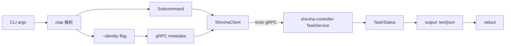

# feat: shiroha-sctl — CLI 客户端(首个 controller 接口消费者)

## 上游对应

本 plan 实现脑暴第三层 CLI 侧(see origin: docs/brainstorms/2026-06-24-shiroha-framework-requirements.md):
- R16 → `sctl` CLI 是首个客户端,通过控制器接口操作主控;Web/GUI 共用同一接口,后续接入

依赖 `shiroha-controller`(proto 生成代码重导出)+ `shiroha-core`(类型)。sctl 是纯客户端,不内嵌 engine/wasm。

## 需求对应

- R16:`sctl` binary —— 命令行覆盖 `TaskService` 全 RPC(创建/查询/暂停/恢复/取消),身份字段通过 CLI flag/ENV 注入 gRPC metadata,验证接口共用性

## Key Technical Decisions

**K1. clap 4.6 derive + string + env + unicode。** workspace 已锁(see workspace `Cargo.toml`),shell 补全用 `clap_complete unstable-dynamic`。

**K2. sctl 是纯客户端,零 engine/wasm 依赖。** 只引 `shiroha-controller::proto` 重导出 + `tonic`(client)+ `clap` + `tokio` + 错误处理(`thiserror`)+ 可能 `reqwest`(若需 HTTP 健康检查;MVP 不需)。不引 wasmtime。

**K3. proto 最终来自 `shiroha-controller`(see shiroha-controller plan U1)。** sctl 通过 `shiroha_controller::proto` 走 workspace path dep 引生成类型,避免重复 proto 编译。

**K4. 身份字段:CLI `--identity` / ENV `SHIROHA_IDENTITY`。** R14 粗粒度,controller 拦截器只验存在;flag 缺失时报错并提示 ENV fallback,不静默发空身份。

**K5. 输出:人类可读 + 可解析(json/text 表格)。** MVP text 表格 + `--output json` flag;复杂查询/过滤 deferred。

## 范围边界

### Deferred to Follow-Up Work

- Web/GUI 客户端 —— R16 接口共用已验证,sctl 是首个证明者
- 复杂输出格式(jq 集成、自定义模板)—— MVP text/json
- 自动补全脚本生成器发布 —— `clap_complete` 机制就绪,具体 shell 脚本发布 deferred
- 节点面 CLI 命令(node register/heartbeat 查询)—— R9 接口 deferred,sctl 不含此命令
- 身份细粒度策略(sts/assume-role 类)—— R14 策略下放 Web 层,sctl 只传透 identity

### Outside this product's identity

- sctl 不内嵌任何状态机/引擎逻辑 —— 纯 RPC 客户端
- sctl 不背身份管理 —— 只传透 `--identity`

## Implementation Units

### U1. CLI 骨架与 subcommand 树

**Goal:** 用 clap derive 建 `sctl` 二进制 + subcommand 树覆盖 TaskService 全 RPC,身份 flag 注入全局 metadata。

**Requirements:** R16

**Dependencies:** shiroha-controller U1(proto 草案可用即可并行,实际 RPC 调用在 U2)

**Files:** `shiroha-sctl/src/main.rs`(create)、`shiroha-sctl/src/cli.rs`(create)、`shiroha-sctl/src/lib.rs`(create)、`shiroha-sctl/Cargo.toml`(create)

**Approach:**
- 顶层 `Cli { #[command(subcommand)] cmd, #[arg(long, env="SHIROHA_IDENTITY")] identity, #[arg(long, default="localhost:50051")] endpoint }`
- subcommands:`task { create | get | list | pause | resume | cancel }`
- 各 subcommand 定义自己的 args(如 `task create --definition <ref> --input <json>`)
- 全局 flag:`--identity`、`--endpoint`、`--output {text,json}`
- clap_complete 在 `completion` 子命令触发动态生成(机制就绪,发布 deferred)

**Patterns to follow:** clap 4.6 derive + `clap_complete unstable-dynamic` 生成。

**Test scenarios:**
- Happy:`sctl --help` 列出所有 subcommand
- Happy:`sctl task --help` 列出 create/get/list/pause/resume/cancel
- Edge:`sctl` 缺 `--identity` 且无 ENV → 报错并提示 `SHIROHA_IDENTITY`
- Edge:未知 subcommand → clap 报错 + exit 2
- Edge:`--endpoint` 格式非法 → 解析报错
- Integration:子命令解析结构可序列化喂给 U2 的 client 层(不依赖真实 server)

**Verification:** `cargo run -p shiroha-sctl -- --help` 全树可见;`cargo test -p shiroha-sctl` CLI 解析单测通过。

### U2. gRPC client 与 RPC 映射

**Goal:** 把每个 subcommand 映射到 `TaskService` RPC 调用,身份 metadata 注入,输出格式化。

**Requirements:** R16

**Dependencies:** U1、shiroha-controller U1(proto 可用)+ U2(server 起则可端到端)

**Files:** `shiroha-sctl/src/client.rs`(create)、`shiroha-sctl/src/output.rs`(create)、`shiroha-sctl/src/commands/task.rs`(create)

**Approach:**
- `ShirohaClient`:tonic `Channel` + `TaskServiceClient<Channel>`,构造时把 `identity` 装进 `Request::metadata` 默认
- 每命令实现:解析 args → 构造 proto request → 调 RPC → 按 `--output` 渲染
- `output`:text 表格 + json 两种;json 用 `serde_json`(workspace deps 暂未锁 `serde_json`,需添加,见 Open Questions)
- 错误:把 tonic `Status` 映射到人类消息 + 退出码(`NotFound`→1,`PermissionDenied`→2,`InvalidArgument`→3)

**Patterns to follow:** tonic 0.14 client 标准模式(`Channel::from_shared` + interceptor / metadata 注入)。

**Test scenarios:**
- Happy:mock tonic in-process server 起于 test,`sctl task get <id>` 命中返回 text 表格
- Edge:`sctl task get <unknown>` → server 返 `not_found` → sctl 退码 1 + “Task not found”
- Edge:`sctl task create` 但 server `permission_denied` → sctl 退码 2
- Happy:`--output json` → 输出合法 JSON 可被解析回结构
- Integration:与 shiroha-controller U2 in-process server 端到端 —— sctl create → server 入 engine → sctl get 看初始态
- Integration:sctl 对 `shiroha-controller::proto::Task` 结构字段稳定依赖(字段不齐时编译错误可见,验证 proto 共用)

**Verification:** `cargo test -p shiroha-sctl` client + 端到端用例通过;`sctl task create --help` 显示参数全;真实跑 `shirohad`(见 shiroha-controller U2)后 sctl 能创建并查询 task。

## High-Level Technical Design

## Assumptions

- 默认 endpoint `localhost:50051`(controller MVP 默认 gRPC 端口);具体端口实现期与 controller 对齐
- `serde_json` workspace 暂未锁(see workspace `Cargo.toml` 已锁 `config 0.15`,其本身依赖 `serde_json`,但 sctl 直接用需在 `[workspace.dependencies]` 加显式)—— 实现期补

## Open Questions

- 输出 text 表格库选择(`prettytable`/`comfy-table`/手写对齐)—— 实现期定,workspace deps 未锁
- `completion` 子命令是否 MVP 发布(shell 脚本生成器)还是仅骨架 deferred —— 倾向骨架就绪、发布 deferred
- 是否加交互式 REPL 模式 —— MVP 不加,延后
- 身份 flag 是否支持从配置文件读取(`~/.shiroha/config`)—— MVP ENV/flag 为主,配置文件 deferred

## Sources & Research

- 无外部研究:全新 workspace;脑暴 R16 + key decisions(CLI 是首个客户端、权限下放 Web 层)为依据
- 内部依据:workspace `Cargo.toml` 锁定的 `clap 4.6` / `clap_complete unstable-dynamic` / `tonic 0.14`